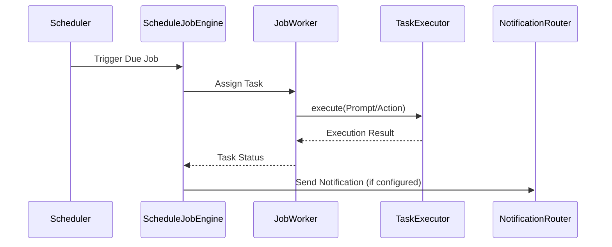

[英文原文](/en/wiki/cubic/scheduling)

::: warning 第三方生成的参考快照
[Cubic 原页面](https://www.cubic.dev/wikis/zhinjs/zhin?page=page-scheduling) · 抓取于 2026-09-23 · [源码提交](https://github.com/zhinjs/zhin/commit/368db14caa4aa91311fb090f07bd792fe4b22fe7)。本页由英文快照机器辅助翻译，尚未逐页与当前代码核验；实际开发请以[维护中的 Zhin 文档](/getting-started/)和[知识库勘误](/wiki/)为准。
:::

::: danger 已确认勘误
Cubic 的部分插件示例源码引用行号指向无关代码块。复制示例前请查看对应文件。参见[调度文档](/authoring/define-plugin)。
:::

::: details 相关源文件

以下文件是 Cubic 生成本页时引用的上下文：

- [basic/schedule/README.md](https://github.com/zhinjs/zhin/blob/368db14caa4aa91311fb090f07bd792fe4b22fe7/basic/schedule/README.md)
- [basic/schedule/package.json](https://github.com/zhinjs/zhin/blob/368db14caa4aa91311fb090f07bd792fe4b22fe7/basic/schedule/package.json)
- [packages/im/agent/tests/assistant/job-engine.test.ts](https://github.com/zhinjs/zhin/blob/368db14caa4aa91311fb090f07bd792fe4b22fe7/packages/im/agent/tests/assistant/job-engine.test.ts)
- [packages/toolkit/create-zhin/template/skills/plugin-develop/SKILL.md](https://github.com/zhinjs/zhin/blob/368db14caa4aa91311fb090f07bd792fe4b22fe7/packages/toolkit/create-zhin/template/skills/plugin-develop/SKILL.md)
- [packages/im/schedule-feature/package.json](https://github.com/zhinjs/zhin/blob/368db14caa4aa91311fb090f07bd792fe4b22fe7/packages/im/schedule-feature/package.json)
- [AGENTS.md](https://github.com/zhinjs/zhin/blob/368db14caa4aa91311fb090f07bd792fe4b22fe7/AGENTS.md)
- [CLAUDE.md](https://github.com/zhinjs/zhin/blob/368db14caa4aa91311fb090f07bd792fe4b22fe7/CLAUDE.md)
:::

# 调度引擎与 Cron

调度引擎为 Zhin.js 提供了一个基于日历语义的调度库。它支持复杂的定时逻辑，包括太阳历和农历 Cron 表达式、中国法定节假日以及持久化作业管理。该系统位于 `basic/schedule` 目录中，并通过 `@zhin.js/kernel` 和 `@zhin.js/agent` 层集成，为插件和 AI Agent 提供调度能力。

来源：[basic/schedule/README.md:1-5](https://github.com/zhinjs/zhin/blob/368db14caa4aa91311fb090f07bd792fe4b22fe7/basic/schedule/README.md#L1-L5), [AGENTS.md:68-75](https://github.com/zhinjs/zhin/blob/368db14caa4aa91311fb090f07bd792fe4b22fe7/AGENTS.md#L68-L75)

## 系统架构

调度系统运行于多个架构层级之上。基础层提供核心日历逻辑，而上层则为特定的IM和Agent工作流封装了该逻辑。

```mermaid
flowchart TD
    subgraph Basic_Layer
        A[@zhin.js/schedule] -->|CalendarScheduler| B[JobStore]
    end
    subgraph Kernel_Layer
        B --> C[@zhin.js/kernel ScheduleEngine]
    end
    subgraph Runtime_Layer
        C --> D[@zhin.js/plugin-runtime scheduleHostToken]
    end
    subgraph Agent_Layer
        D --> E[@zhin.js/agent ScheduleJobEngine]
    end
    E --> F[AI Assistant Tasks]
```
该图展示了从基本调度库到高层级 Agent 作业引擎的向上依赖流。
来源：[basic/schedule/README.md:12-20](https://github.com/zhinjs/zhin/blob/368db14caa4aa91311fb090f07bd792fe4b22fe7/basic/schedule/README.md#L12-L20), [CLAUDE.md:73-85](https://github.com/zhinjs/zhin/blob/368db14caa4aa91311fb090f07bd792fe4b22fe7/CLAUDE.md#L73-L85)

## 计划功能

`CalendarScheduler` 作为管理基于时间触发的主引擎，支持传统Cron表达式以及针对中国农历的特殊需求。

### 支持的计划类型
系统将触发器划分为多种类型，以应对复杂的区域化需求。

| 类型 | 描述 |
| :--- | :--- |
| `solar` | 标准格里高利历Cron（6个段：秒、分钟、小时、日、月、周） |
| `lunar` | 中国传统农历日历Cron |
| `workday` | 法定工作日，包含调整后的周末工作日 |
| `freeDay` | 休息日和周末 |
| `holiday` | 特定节日区间（例如春节） |
| `scatter` | 在特定时间窗口内随机或分散触发 |

来源：[basic/schedule/README.md:37-47](https://github.com/zhinjs/zhin/blob/368db14caa4aa91311fb090f07bd792fe4b22fe7/basic/schedule/README.md#L37-L47), [basic/schedule/package.json:3-5](https://github.com/zhinjs/zhin/blob/368db14caa4aa91311fb090f07bd792fe4b22fe7/basic/schedule/package.json#L3-L5)

### 假期数据管理
引擎内置了2019年至2026年基于国务院公告的假期数据。用户可以通过调用 `HolidayCalendar.update` 方法或通过同步脚本（如 `sync-holiday.mjs`）在运行时更新这些数据集。
来源：[basic/schedule/README.md:52-60](https://github.com/zhinjs/zhin/blob/368db14caa4aa91311fb090f07bd792fe4b22fe7/basic/schedule/README.md#L52-L60)

## 持久化存储（JobStore）

调度引擎支持多种持久化后端，以确保作业在进程重启后仍能存活。`JobStore` 接口根据项目规模提供了不同的实现方式。

*   **本地 JSON 存储**：通过 `createLocalJsonStore` 创建，适用于小型独立运行的机器人。
*   **SQLite 存储**：通过 `createSqliteStore` 创建，提供关系型持久化功能。
*   **Redis 存储**：通过 `createRedisStore` 创建，支持多个工作实例之间的作业声明。

来源：[basic/schedule/README.md:66-72](https://github.com/zhinjs/zhin/blob/368db14caa4aa91311fb090f07bd792fe4b22fe7/basic/schedule/README.md#L66-L72)

## Agent 集成（ScheduleJobEngine）

`@zhin.js/agent` 包中的 `ScheduleJobEngine` 负责管理 AI Agent 的定时任务。它将调度器与 `JobWorker` 和 `TaskExecutor` 进行关联。

### 任务执行流程
当达到预定时间时，引擎将协调任务的执行和通知。


该流程展示了调度器、工作节点和AI任务执行器之间的内部通信。
来源：[packages/im/agent/tests/assistant/job-engine.test.ts:28-50](https://github.com/zhinjs/zhin/blob/368db14caa4aa91311fb090f07bd792fe4b22fe7/packages/im/agent/tests/assistant/job-engine.test.ts#L28-L50)

### 作业配置
代理作业包含用于正确执行上下文的元数据：
*   **createdBy**：标识发起该作业的用户（userId，角色）。
*   **executionPlan**：包含Agent 的提示、所需工具和技能。
*   **notify**：成功或失败反馈的配置（例如，`silent` 或特定的IM通道）。

来源：[packages/im/agent/tests/assistant/job-engine.test.ts:52-105](https://github.com/zhinjs/zhin/blob/368db14caa4aa91311fb090f07bd792fe4b22fe7/packages/im/agent/tests/assistant/job-engine.test.ts#L52-L105)

## 插件实现

开发者使用 `scheduleHostToken` 在 Zhin 插件中注册定时任务。这是 1.1.x 稳定版本线推荐的方案，已逐步取代旧的命令式 API。

```typescript
// plugin.ts
import { definePlugin, scheduleHostToken } from 'zhin.js';

export default definePlugin({
  name: 'example-plugin',
  setup(context) {
    if (!context.resources.has(scheduleHostToken)) return;
    const schedule = context.resources.use(scheduleHostToken);

    context.lifecycle.add(
      schedule.register({
        id: 'my-plugin/hourly-task',
        cron: '0 0 * * * *',
        async execute() {
          console.log('Task executed');
        },
      }),
    );
  },
});
```
来源：[packages/toolkit/create-zhin/template/skills/plugin-develop/SKILL.md:67-84](https://github.com/zhinjs/zhin/blob/368db14caa4aa91311fb090f07bd792fe4b22fe7/packages/toolkit/create-zhin/template/skills/plugin-develop/SKILL.md#L67-L84), [CLAUDE.md:110-120](https://github.com/zhinjs/zhin/blob/368db14caa4aa91311fb090f07bd792fe4b22fe7/CLAUDE.md#L110-L120)

## 概述

调度引擎与定时任务系统提供了一个强大且具备日历感知能力的调度解决方案，深度集成于 Zhin.js 架构之中。通过使用 `CalendarScheduler` 和持久化的 `JobStore` 实现，该框架能够确保在各种时间场景下（包括特定中国节假日的调整）任务的可靠执行。对于 AI Agent 来说，`ScheduleJobEngine` 实现了时间触发与自动化 Agent 操作之间的桥梁，支持诸如早晨简报或定期维护任务等复杂调度工作流。
