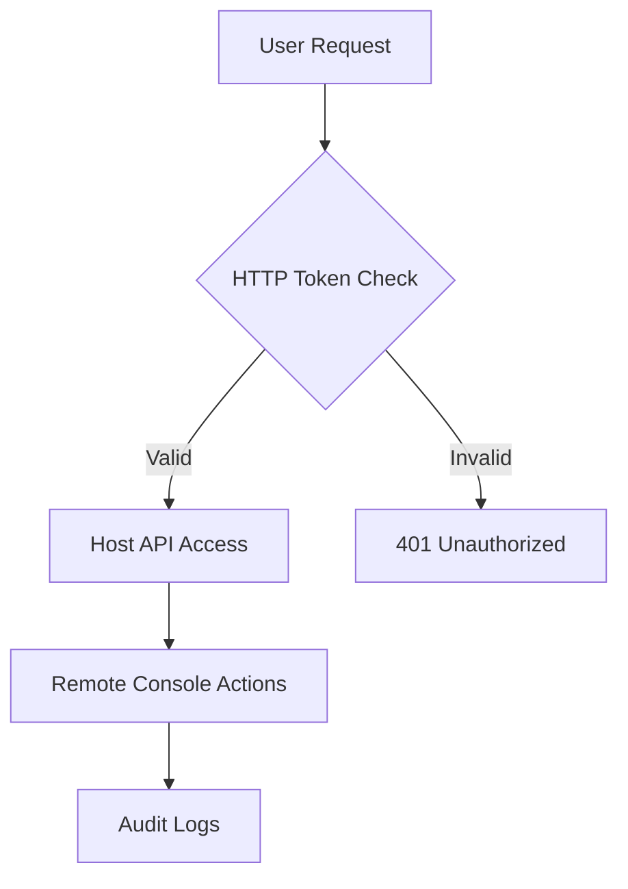
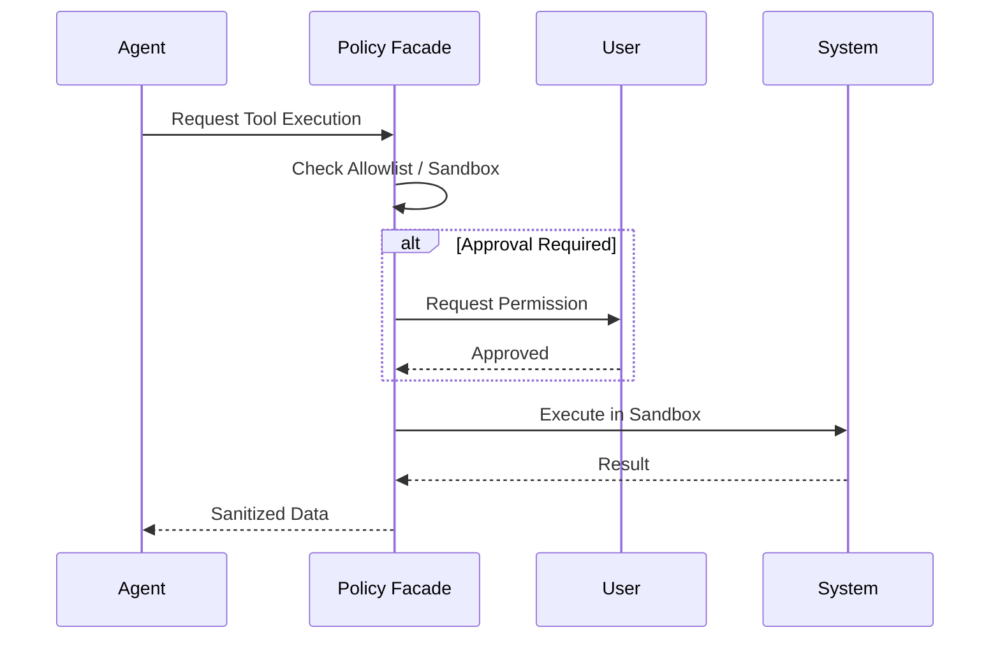

[英文原文](/en/wiki/cubic/security-policy)

::: warning 第三方生成的参考快照
[Cubic 原页面](https://www.cubic.dev/wikis/zhinjs/zhin?page=page-security-policy) · 抓取于 2026-09-23 · [源码提交](https://github.com/zhinjs/zhin/commit/368db14caa4aa91311fb090f07bd792fe4b22fe7)。本页由英文快照机器辅助翻译，尚未逐页与当前代码核验；实际开发请以[维护中的 Zhin 文档](/getting-started/)和[知识库勘误](/wiki/)为准。
:::

::: danger 已确认勘误
新脚手架项目当前配置 HTTP 端口 `8068`；`8086` 是 Runtime 未配置端口时的回退值。内置 Agent 默认值是 `execSecurity: deny` 和 `execApprovalMode: auto`，项目配置可以覆盖。请核对启动输出或 `http.port`。参见[快速开始](/getting-started/)。
:::

::: details 相关源文件

以下文件是 Cubic 生成本页时引用的上下文：

- [SECURITY.md](https://github.com/zhinjs/zhin/blob/368db14caa4aa91311fb090f07bd792fe4b22fe7/SECURITY.md)
- [AGENTS.md](https://github.com/zhinjs/zhin/blob/368db14caa4aa91311fb090f07bd792fe4b22fe7/AGENTS.md)
- [CLAUDE.md](https://github.com/zhinjs/zhin/blob/368db14caa4aa91311fb090f07bd792fe4b22fe7/CLAUDE.md)
- [agents/dev/system.md](https://github.com/zhinjs/zhin/blob/368db14caa4aa91311fb090f07bd792fe4b22fe7/agents/dev/system.md)
- [packages/toolkit/create-zhin/README.md](https://github.com/zhinjs/zhin/blob/368db14caa4aa91311fb090f07bd792fe4b22fe7/packages/toolkit/create-zhin/README.md)
- [basic/cli/src/commands/setup.ts](https://github.com/zhinjs/zhin/blob/368db14caa4aa91311fb090f07bd792fe4b22fe7/basic/cli/src/commands/setup.ts)
:::

# 安全策略与最佳实践

Zhin.js 实现了多层安全模型，以保护其基于插件的架构和 AI Agent 执行环境。本政策明确了如何报告漏洞、管理凭证，以及在框架内实现安全的插件逻辑。

## 漏洞报告与响应

Zhin.js 团队优先处理安全问题。建议您通过私密方式披露漏洞，而非通过公开的 GitHub 问题。

### 报告渠道
*   **首选方式**：通过邮件将发现发送至 [security@zhin.dev](mailto:security@zhin.dev)。
*   **备选方式**：使用 [GitHub 安全建议](https://github.com/zhinjs/zhin/security/advisories) 的私有报告功能。

### 响应时间线
团队遵循结构化的时间线进行漏洞评估和修复：
1.  **确认接收**：在收到后 48 小时内回复。
2.  **初步评估**：在 5 个工作日内完成，包含预计修复周期。
3.  **修复发布**：
    *   高危级别：7-14 天。
    *   中危级别：14-30 天。
    *   低危级别：30-60 天。

来源：[SECURITY.md:204-228](https://github.com/zhinjs/zhin/blob/368db14caa4aa91311fb090f07bd792fe4b22fe7/SECURITY.md#L204-L228)
## 用户最佳实践

管理 Zhin.js 实例的用户必须保持环境的整洁，并限制对管理接口的访问。

### 凭证保护
*   **环境变量**：将敏感密钥存储在 `.env` 文件中，并通过 `${VAR_NAME}` 语法在 `zhin.config.yml` 中引用。
*   **版本控制**：请勿将 `.env` 文件提交到 git；该项目默认包含 `.env`（在 `.gitignore` 中）。
*   **HTTP令牌**：为Web控制台使用一个强`HTTP_TOKEN`。 scaffolding向导默认生成一个随机的32位十六进制字符串。

### 访问控制
*   **主机 API**：使用防火墙规则或 Nginx 等反向代理，限制主机 API（默认 `:8086`）仅允许可信来源访问。
*   **生产环境配置**：通过设置 `NODE_ENV=production` 来禁用生产环境中的文件监控，以防止系统资源（如 inotify 限制）耗尽。

该图展示了通过远程控制台访问主机 API 的认证流程。

来源：[SECURITY.md:232-261](https://github.com/zhinjs/zhin/blob/368db14caa4aa91311fb090f07bd792fe4b22fe7/SECURITY.md#L232-L261), [packages/toolkit/create-zhin/README.md:126-135](https://github.com/zhinjs/zhin/blob/368db14caa4aa91311fb090f07bd792fe4b22fe7/packages/toolkit/create-zhin/README.md#L126-L135), [SECURITY.md:329-338](https://github.com/zhinjs/zhin/blob/368db14caa4aa91311fb090f07bd792fe4b22fe7/SECURITY.md#L329-L338)

## 开发者安全指南

插件开发者有责任对输入进行清理，并在 Zhin.js 运行时中防止注入攻击。

### 输入验证
始终验证和清理用户输入。Zhin.js 提供了**模式（Schema）**系统用于类型检查和范围验证。

```typescript
import { Schema } from '@zhin.js/schema'

const Input = Schema.object({
  url: Schema.string().pattern(/^https?:\/\//),
  count: Schema.number().min(1).max(100)
})
const input = Input(untrustedInput)
```
来源：[SECURITY.md:273-282](https://github.com/zhinjs/zhin/blob/368db14caa4aa91311fb090f07bd792fe4b22fe7/SECURITY.md#L273-L282)

### 注入防护
开发者必须在数据库操作中使用参数化查询。严禁将字符串拼接进SQL查询语句中。
*   **正确示例**：`db.model('users').findOne({ where: { id: userId } })`
*   **错误示例**：`db.query("SELECT * FROM users WHERE id = " + userId)`

来源：[SECURITY.md:284-290](https://github.com/zhinjs/zhin/blob/368db14caa4aa91311fb090f07bd792fe4b22fe7/SECURITY.md#L284-L290)

### 错误处理
不要将敏感的堆栈追踪或内部配置泄露到聊天渠道中。对终端用户使用通用错误消息，同时将详细错误记录到内部日志中。

来源：[SECURITY.md:309-317](https://github.com/zhinjs/zhin/blob/368db14caa4aa91311fb090f07bd792fe4b22fe7/SECURITY.md#L309-L317)

## Agent 安全架构

Zhin.js Agent 组件包含高层级的安全策略，用于管理工具执行和资源访问。

### 执行与文件策略
Agent 安全性通过两个主要策略层进行控制：
*   **ExecPolicy**：通过五层防御机制（例如允许列表）管理 shell 命令的执行。
*   **FilePolicy**：通过四层防御机制限制文件系统访问，防止路径遍历攻击。

### 工具安全配置
内置工具默认采用严格的安全设置：
*   `execSecurity`：默认值为 `deny`。
*   `execApprovalMode`：默认值为 `auto`。


此图展示了在AI代理执行系统工具之前所进行的安全检查顺序。

来源：[CLAUDE.md:144-150](https://github.com/zhinjs/zhin/blob/368db14caa4aa91311fb090f07bd792fe4b22fe7/CLAUDE.md#L144-L150), [AGENTS.md:105-108](https://github.com/zhinjs/zhin/blob/368db14caa4aa91311fb090f07bd792fe4b22fe7/AGENTS.md#L105-L108), [agents/dev/system.md:46-52](https://github.com/zhinjs/zhin/blob/368db14caa4aa91311fb090f07bd792fe4b22fe7/agents/dev/system.md#L46-L52)

## 已知的安全考虑

| 特性 | 安全风险 | 缓解措施 |
| :--- | :--- | :--- |
| **插件系统** | 插件在同一个进程中运行，具有完整的系统访问权限。 | 仅从可信来源安装插件。 |
| **热重载** | 可能导致在被入侵的环境中发生未经授权的代码执行。 | 生产环境中禁用。 |
| **远程控制台** | 默认监听在 `0.0.0.0` 上，会暴露接口。 | 限制为 `127.0.0.1`，或使用带 HTTPS 的反向代理。 |
| **文件监控** | 资源耗尽（inotify）。 | 避免监控 `node_modules`；指定精确的插件目录。 |

来源：[SECURITY.md:320-338](https://github.com/zhinjs/zhin/blob/368db14caa4aa91311fb090f07bd792fe4b22fe7/SECURITY.md#L320-L338)

## 安全路线图

该框架计划在未来版本中引入以下增强功能：
*   **细粒度插件权限**：一种用于限制特定插件功能的系统。
*   **代码签名**：在加载插件前验证其完整性。
*   **双因素认证（2FA）**：提升远程控制台的安全性。
*   **沙箱隔离**：在独立环境中执行插件，而非在主进程中运行。

来源：[SECURITY.md:342-350](https://github.com/zhinjs/zhin/blob/368db14caa4aa91311fb090f07bd792fe4b22fe7/SECURITY.md#L342-L350)
