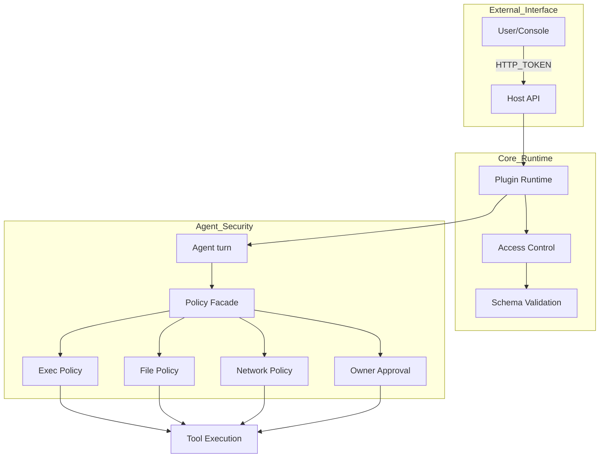
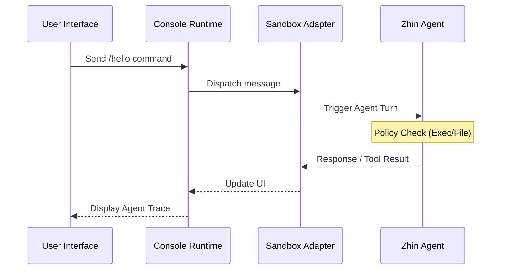

[英文原文](/en/wiki/cubic/security-sandbox)

::: warning 第三方生成的参考快照
[Cubic 原页面](https://www.cubic.dev/wikis/zhinjs/zhin?page=page-security-sandbox) · 抓取于 2026-09-23 · [源码提交](https://github.com/zhinjs/zhin/commit/368db14caa4aa91311fb090f07bd792fe4b22fe7)。本页由英文快照机器辅助翻译，尚未逐页与当前代码核验；实际开发请以[维护中的 Zhin 文档](/getting-started/)和[知识库勘误](/wiki/)为准。
:::

::: danger 已确认勘误
`execApprovalMode` 的取值是 `ask | auto | bypass`。Tool 的 `requiresApproval` 是独立字段，取值为 `never | on-risk | once | always`；两者不能混用。下文的审批模式表格已过时。参见[Agent 配置](/ai/)和[工具开发](/authoring/agent-tools)。
:::

::: details 相关源文件

以下文件是 Cubic 生成本页时引用的上下文：

- [SECURITY.md](https://github.com/zhinjs/zhin/blob/368db14caa4aa91311fb090f07bd792fe4b22fe7/SECURITY.md)
- [AGENTS.md](https://github.com/zhinjs/zhin/blob/368db14caa4aa91311fb090f07bd792fe4b22fe7/AGENTS.md)
- [CLAUDE.md](https://github.com/zhinjs/zhin/blob/368db14caa4aa91311fb090f07bd792fe4b22fe7/CLAUDE.md)
- [basic/cli/src/commands/setup.ts](https://github.com/zhinjs/zhin/blob/368db14caa4aa91311fb090f07bd792fe4b22fe7/basic/cli/src/commands/setup.ts)
- [plugins/adapters/sandbox/tests/sandbox-console.test.ts](https://github.com/zhinjs/zhin/blob/368db14caa4aa91311fb090f07bd792fe4b22fe7/plugins/adapters/sandbox/tests/sandbox-console.test.ts)
- [agents/ops/system.md](https://github.com/zhinjs/zhin/blob/368db14caa4aa91311fb090f07bd792fe4b22fe7/agents/ops/system.md)
:::

# 安全策略与沙箱

Zhin.js 框架实现了一种多层安全模型，以保护聊天机器人运行时环境、开发人员凭证以及用户数据。该系统规范了插件访问系统资源的方式、AI Agent 执行工具的流程，以及远程控制台对管理请求的认证机制。安全架构优先考虑隔离性、对高风险操作的显式授权，以及通过环境变量注入方式保护凭证。

## 安全架构概览

Zhin.js 的安全模型覆盖三个主要领域：插件运行时、AI Agent 协调器以及主机 API。尽管当前插件运行在同一个进程中并拥有完整的系统访问权限，但框架提供了内置机制来限制行为，并通过专用适配器实现测试环境的隔离。


该示意图展示了从外部请求开始，经过核心运行时，最终进入控制AI代理工具执行的细粒度策略中的安全验证流程。
来源：[AGENTS.md:162-170](https://github.com/zhinjs/zhin/blob/368db14caa4aa91311fb090f07bd792fe4b22fe7/AGENTS.md#L162-L170), [SECURITY.md:214-230](https://github.com/zhinjs/zhin/blob/368db14caa4aa91311fb090f07bd792fe4b22fe7/SECURITY.md#L214-L230), [CLAUDE.md:188-195](https://github.com/zhinjs/zhin/blob/368db14caa4aa91311fb090f07bd792fe4b22fe7/CLAUDE.md#L188-L195)

## Agent安全策略

Agent架构通过工程化手段为AI驱动的操作提供了防御边界。该框架使用中央化的`policy-facade.ts`来协调多个安全检查，在任何工具执行之前均会进行验证。

### 执行与文件策略
该框架对代理与主机系统的交互施加了特定限制：
*   **执行策略（`ExecPolicy`）**：通过预批准二进制文件的白名单来限制shell命令的执行。
*   **文件策略（`FilePolicy`）**：限制文件系统访问范围，仅允许访问指定目录，防止代理读取敏感配置文件或写入系统路径。
*   **网络策略**：阻止访问私有IP地址段，并强制对外出请求实施域名白名单控制。

### 工具审批模式
工具的执行行为取决于配置的`execApprovalMode`。您可以在`zhin.config.yml`中的`agent`部分定义这些模式。

| 审批模式 | 行为 |
| :--- | :--- |
| `ask` | 代理在执行工具前必须请求用户明确授权。 |
| `allowlist` | 安全清单中的内置工具将自动执行；其他工具需手动审批。 |
| `never` | 禁用工具执行（用于受限环境）。 |
| `always` | 所有工具均自动执行，无需提示（不推荐用于生产环境）。 |

来源：[AGENTS.md:210-215](https://github.com/zhinjs/zhin/blob/368db14caa4aa91311fb090f07bd792fe4b22fe7/AGENTS.md#L210-L215), [CLAUDE.md:188-195](https://github.com/zhinjs/zhin/blob/368db14caa4aa91311fb090f07bd792fe4b22fe7/CLAUDE.md#L188-L195), [README.md:195-205](https://github.com/zhinjs/zhin/blob/368db14caa4aa91311fb090f07bd792fe4b22fe7/README.md#L195-L205)

## 沙箱环境

沙箱环境提供了一个隔离的测试平台，用于在不影响实时聊天平台的情况下开发和测试代理。它包含一个专用的适配器以及远程控制台中的专用网页界面。

### 沙箱功能
*   **代理测试台**：一个名为“代理试验台”（Agent Playground）的专用控制台页面，可实时监控代理的运行轨迹和工具执行日志。
*   **隔离消息传递**：`@zhin.js/adapter-sandbox` 会将消息通过内部 WebSockets 通道传递，而非调用外部 API。
*   **元数据提取**：系统使用 `extractPageMetadata` 在基于约定的插件加载过程中发现沙箱页面。


该序列展示了用户界面与沙箱环境中代理之间的交互。
来源：[plugins/adapters/sandbox/tests/sandbox-console.test.ts:32-60](https://github.com/zhinjs/zhin/blob/368db14caa4aa91311fb090f07bd792fe4b22fe7/plugins/adapters/sandbox/tests/sandbox-console.test.ts#L32-L60), [CLAUDE.md:196-198](https://github.com/zhinjs/zhin/blob/368db14caa4aa91311fb090f07bd792fe4b22fe7/CLAUDE.md#L196-L198)

## 证书保护与访问控制

Zhin.js 通过配置管理与网络限制，防止敏感信息的意外泄露。

### 环境变量注入
您绝对不能在 `zhin.config.yml` 中硬编码 API 密钥或令牌。该框架支持使用 `${ENV_VAR}` 语法进行动态注入。`zhin setup` 命令可通过将敏感值写入一个被版本控制忽略的 `.env` 文件来实现此功能。

```yaml
# Recommended secure configuration
ai:
  providers:
    openai-main:
      sdk: openai
      apiKey: ${AI_API_KEY}
http:
  token: ${HTTP_TOKEN}
```
来源：[basic/cli/src/commands/setup.ts:167-175](https://github.com/zhinjs/zhin/blob/368db14caa4aa91311fb090f07bd792fe4b22fe7/basic/cli/src/commands/setup.ts#L167-L175), [SECURITY.md:88-95](https://github.com/zhinjs/zhin/blob/368db14caa4aa91311fb090f07bd792fe4b22fe7/SECURITY.md#L88-L95), [README.md:188-193](https://github.com/zhinjs/zhin/blob/368db14caa4aa91311fb090f07bd792fe4b22fe7/README.md#L188-L193)

### 主机 API 安全性
主机 API（默认端口为 `8086`）要求所有管理操作均需提供强 `HTTP_TOKEN` 验证。
*   **身份验证**：请求必须在 `Authorization: Bearer` 头部或作为 `?token=` 查询参数中包含令牌。
*   **CORS**：框架限制 API 访问仅限于授权来源，例如 `https://console.zhin.dev`。
*   **生产环境加固**：用户应使用防火墙规则和 Nginx 等反向代理来限制主机 API 的暴露。

来源：[SECURITY.md:214-216](https://github.com/zhinjs/zhin/blob/368db14caa4aa91311fb090f07bd792fe4b22fe7/SECURITY.md#L214-L216), [packages/toolkit/create-zhin/README.md:120-130](https://github.com/zhinjs/zhin/blob/368db14caa4aa91311fb090f07bd792fe4b22fe7/packages/toolkit/create-zhin/README.md#L120-L130), [basic/cli/src/commands/setup.ts:175-180](https://github.com/zhinjs/zhin/blob/368db14caa4aa91311fb090f07bd792fe4b22fe7/basic/cli/src/commands/setup.ts#L175-L180)

## 插件安全最佳实践

开发者必须遵循特定的验证模式，以防止常见的漏洞，如注入和数据泄露。

*   **输入验证**：使用 `@zhin.js/schema` 系统来定义和验证用户输入。该系统提供自动类型检查和清理功能。
*   **防止注入**：在与数据库交互时，始终使用参数化查询。切勿通过字符串拼接来构造 SQL 命令。
*   **错误处理**：实现错误边界，防止将堆栈跟踪或内部系统路径泄露给终端用户。只有将详细错误日志记录到内部日志系统中。

```typescript
// Correct input validation using Schema
import { Schema } from '@zhin.js/schema'

const Input = Schema.object({
  url: Schema.string().pattern(/^https?:\/\//),
  count: Schema.number().min(1).max(100)
})

const input = Input(untrustedInput)
```
来源：[SECURITY.md:110-125](https://github.com/zhinjs/zhin/blob/368db14caa4aa91311fb090f07bd792fe4b22fe7/SECURITY.md#L110-L125), [SECURITY.md:148-160](https://github.com/zhinjs/zhin/blob/368db14caa4aa91311fb090f07bd792fe4b22fe7/SECURITY.md#L148-L160)

## 安全治理概览

Zhin.js 的安全系统针对高级功能采用“按需启用”模式，而在凭证处理方面则遵循“默认安全”原则。尽管核心框架保持轻量化设计，但引入 `@zhin.js/agent` 后，系统将配备一个全面的策略引擎，用于管控所有 AI 交互行为。沙箱环境作为主要工具，可在部署前安全地评估这些策略。
来源：[AGENTS.md:10-20](https://github.com/zhinjs/zhin/blob/368db14caa4aa91311fb090f07bd792fe4b22fe7/AGENTS.md#L10-L20), [README.md:140-150](https://github.com/zhinjs/zhin/blob/368db14caa4aa91311fb090f07bd792fe4b22fe7/README.md#L140-L150)
