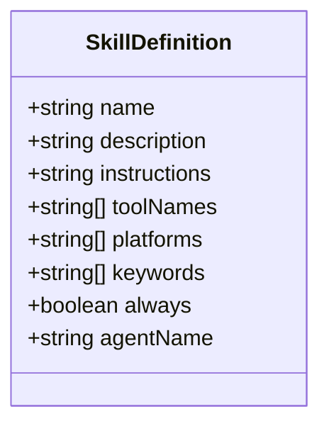
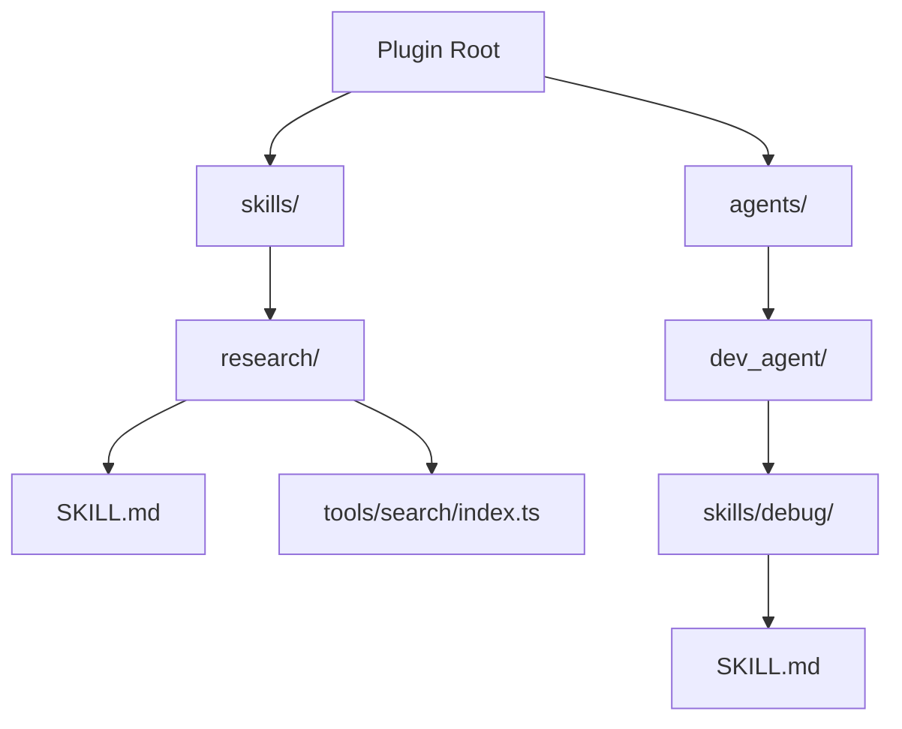
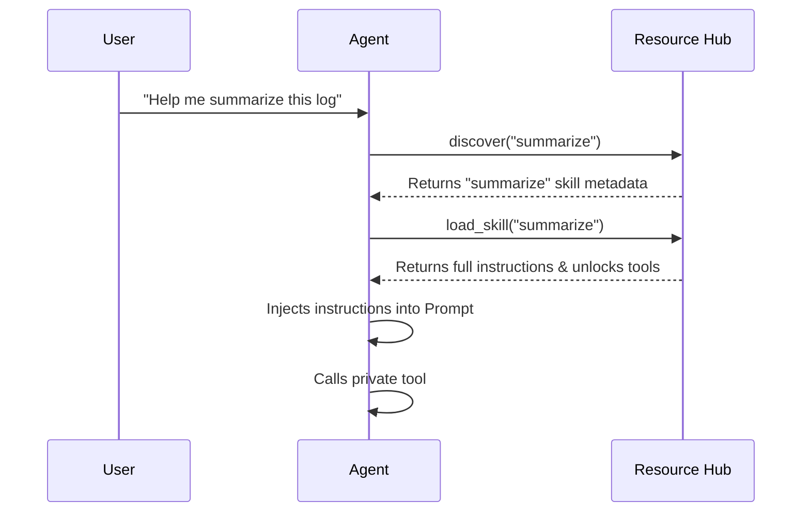

[英文原文](/en/wiki/cubic/skills)

::: warning 第三方生成的参考快照
[Cubic 原页面](https://www.cubic.dev/wikis/zhinjs/zhin?page=page-skills) · 抓取于 2026-09-23 · [源码提交](https://github.com/zhinjs/zhin/commit/368db14caa4aa91311fb090f07bd792fe4b22fe7)。本页由英文快照机器辅助翻译，尚未逐页与当前代码核验；实际开发请以[维护中的 Zhin 文档](/getting-started/)和[知识库勘误](/wiki/)为准。
:::

::: details 相关源文件

以下文件是 Cubic 生成本页时引用的上下文：

- [packages/im/skill/src/definition.ts](https://github.com/zhinjs/zhin/blob/368db14caa4aa91311fb090f07bd792fe4b22fe7/packages/im/skill/src/definition.ts)
- [packages/im/skill/README.md](https://github.com/zhinjs/zhin/blob/368db14caa4aa91311fb090f07bd792fe4b22fe7/packages/im/skill/README.md)
- [packages/im/agent/src/skill/skill-instructions.ts](https://github.com/zhinjs/zhin/blob/368db14caa4aa91311fb090f07bd792fe4b22fe7/packages/im/agent/src/skill/skill-instructions.ts)
- [packages/im/skill/src/provider.ts](https://github.com/zhinjs/zhin/blob/368db14caa4aa91311fb090f07bd792fe4b22fe7/packages/im/skill/src/provider.ts)
- [packages/toolkit/create-zhin/template/skills/skill-creator/SKILL.md](https://github.com/zhinjs/zhin/blob/368db14caa4aa91311fb090f07bd792fe4b22fe7/packages/toolkit/create-zhin/template/skills/skill-creator/SKILL.md)
- [AGENTS.md](https://github.com/zhinjs/zhin/blob/368db14caa4aa91311fb090f07bd792fe4b22fe7/AGENTS.md)
- [packages/im/agent/src/prompt/system-prompt.ts](https://github.com/zhinjs/zhin/blob/368db14caa4aa91311fb090f07bd792fe4b22fe7/packages/im/agent/src/prompt/system-prompt.ts)
- [basic/cli/src/commands/new.ts](https://github.com/zhinjs/zhin/blob/368db14caa4aa91311fb090f07bd792fe4b22fe7/basic/cli/src/commands/new.ts)
:::

# Skill 与渐进披露

技能是定义在 Markdown 文件（`SKILL.md`）中的、面向行动、可检索且可执行的工作流。它们使 Zhin Agent 能够执行复杂且可重复的任务，而无需在初始上下文窗口中塞入过多内容。Zhin 采用渐进披露机制来高效管理这些能力。

系统最初仅披露高层元数据，完整的操作说明和私有工具将保持隐藏，直到 Agent 显式激活该技能。这种做法可节省令牌，并确保 Agent 专注于当前任务所需的相关工具。
来源：[packages/im/skill/README.md:1-24](https://github.com/zhinjs/zhin/blob/368db14caa4aa91311fb090f07bd792fe4b22fe7/packages/im/skill/README.md#L1-L24), [packages/toolkit/create-zhin/template/skills/skill-creator/SKILL.md:1-12](https://github.com/zhinjs/zhin/blob/368db14caa4aa91311fb090f07bd792fe4b22fe7/packages/toolkit/create-zhin/template/skills/skill-creator/SKILL.md#L1-L12)

## 技能结构与定义

每个技能由一个位于专用目录中的 `SKILL.md` 文件定义。该文件包含 YAML 首部元数据和用于任务说明的 Markdown 内容。

### 元数据（首部）
首部定义了技能的发现方式以及所需资源。

| 字段 | 类型 | 描述 |
| :--- | :--- | :--- |
| `name` | 字符串 | 必须与目录名称的 kebab-case 形式一致。 |
| `description` | 字符串 | 一句话摘要，包含触发词和使用场景。 |
| `keywords` | 字符串数组 | 英文及本地化触发词，用于搜索。 |
| `tools` | 字符串数组 | 该技能所需的核心工具列表。 |
| `platforms` | 字符串数组 | 该技能支持的具体 IM 平台。 |
| `scopes` | 字符串数组 | 支持与 `private`、`group` 或 `channel` 的交互。 |
| `always` | 布尔值 | 若为 true，则始终注入技能说明。 |

来源：[packages/im/skill/src/definition.ts:10-75](https://github.com/zhinjs/zhin/blob/368db14caa4aa91311fb090f07bd792fe4b22fe7/packages/im/skill/src/definition.ts#L10-L75), [packages/toolkit/create-zhin/template/skills/skill-creator/SKILL.md:25-36](https://github.com/zhinjs/zhin/blob/368db14caa4aa91311fb090f07bd792fe4b22fe7/packages/toolkit/create-zhin/template/skills/skill-creator/SKILL.md#L25-L36)

### 运行时定义
`SkillDefinition` 接口表示技能的解析后不可变的运行时形式。

该图展示了在代理执行轮次期间用于管理技能元数据和指令的内部数据结构。
来源：[packages/im/skill/src/definition.ts:12-25](https://github.com/zhinjs/zhin/blob/368db14caa4aa91311fb090f07bd792fe4b22fe7/packages/im/skill/src/definition.ts#L12-L25)

## 技能发现与约定

Zhin 根据特定的目录约定来发现技能。这支持全局技能和 Agent 私有技能两种类型。

### 目录结构
*   **全局技能**：位于插件根目录下的 `skills/` 目录中。
*   **Agent 私有技能**：位于 `agents/<agent_name>/skills/` 目录中。
*   **私有工具**：技能可以在 `tools/` 子目录中包含本地工具，这些工具仅在技能激活时可见。

该流程图展示了技能索引查找定义的位置，以及私有工具如何嵌套在技能目录中。
来源：[packages/im/skill/README.md:5-17](https://github.com/zhinjs/zhin/blob/368db14caa4aa91311fb090f07bd792fe4b22fe7/packages/im/skill/README.md#L5-L17), [packages/im/skill/src/provider.ts:13-53](https://github.com/zhinjs/zhin/blob/368db14caa4aa91311fb090f07bd792fe4b22fe7/packages/im/skill/src/provider.ts#L13-L53)

## 逐步揭示机制

逐步揭示通过优化Agent的系统提示，仅在必要时才暴露复杂性。

1. **初始状态**：Agent的系统提示中包含一个`Skills (catalog)`部分。该目录中仅包含可用技能的名称及其简要描述（最多96个字符）。
2. **搜索**：Agent使用`discover(kind)`工具，根据用户输入和技能关键词查找相关技能。
3. **激活**：Agent调用`load_skill`。
4. **注入**：Zhin解析`SKILL.md`，提取如`Workflow`或`Quick Actions`等特定部分，并将其注入到提示中的“当前激活技能”部分。
5. **工具揭示**：与该技能关联的私有工具将被解锁，并添加到Agent当前回合的工具集合中。

该流程展示了代理与资源中心之间的交互，逐步披露其能力。
来源：[packages/im/skill/README.md:19-24](https://github.com/zhinjs/zhin/blob/368db14caa4aa91311fb090f07bd792fe4b22fe7/packages/im/skill/README.md#L19-L24), [packages/im/agent/src/prompt/system-prompt.ts:153-176](https://github.com/zhinjs/zhin/blob/368db14caa4aa91311fb090f07bd792fe4b22fe7/packages/im/agent/src/prompt/system-prompt.ts#L153-L176), [packages/im/agent/src/skill/skill-instructions.ts:35-58](https://github.com/zhinjs/zhin/blob/368db14caa4aa91311fb090f07bd792fe4b22fe7/packages/im/agent/src/skill/skill-instructions.ts#L35-L58)

## 指令处理

Zhin 会处理 `SKILL.md` 中的 Markdown 内容，以确保 Agent 能接收到可执行的指导。

*   **提取**：系统优先选择标题为 `Workflow`、`Instructions` 或 `使用说明` 的部分。如果这些部分缺失，则使用引言部分的内容。
*   **预算控制**：若指令长度超过 `maxBodyLength`（默认为 4000 个字符），系统将截断指令。
*   **依赖检查**：系统会通过 `which` 检查前端元数据中声明的可执行依赖项（例如 shell 命令），若缺少必要条件则发出警告。
*   **操作强制**：每条提取的指令末尾都会附带一个“立即行动”指令，禁止 Agent 重复执行 `load_skill` 或使用文本描述代替工具调用。

来源：[packages/im/agent/src/skill/skill-instructions.ts:9-85](https://github.com/zhinjs/zhin/blob/368db14caa4aa91311fb090f07bd792fe4b22fe7/packages/im/agent/src/skill/skill-instructions.ts#L9-L85)

## 技能实现要求

在实现技能时，必须遵循标准工作流，以确保与发现引擎的兼容性。

1. **定义边界**：每个技能必须处理一个可重复的任务，且该任务可以在单次对话轮次中完成。
2. **前端元数据**：需包含覆盖常见用户语句的触发词。
3. **编号工作流**：详细说明每一步的输入、操作和输出。
4. **失败处理**：提供“失败与降级”表，明确工具失败时应采取的措施。
5. D. **检查点**：包含敏感信息检查，以防止泄露令牌或内部URL。

来源：[packages/toolkit/create-zhin/template/skills/skill-creator/SKILL.md:15-88](https://github.com/zhinjs/zhin/blob/368db14caa4aa91311fb090f07bd792fe4b22fe7/packages/toolkit/create-zhin/template/skills/skill-creator/SKILL.md#L15-L88), [packages/toolkit/create-zhin/template/skills/summarize/SKILL.md:28-110](https://github.com/zhinjs/zhin/blob/368db14caa4aa91311fb090f07bd792fe4b22fe7/packages/toolkit/create-zhin/template/skills/summarize/SKILL.md#L28-L110)

技能系统结合渐进披露机制，确保了Zhin智能体保持轻量级和高响应性，同时能够访问丰富的专用能力库。通过目录约定和Markdown契约，开发者可以轻松扩展智能体行为，而无需修改核心逻辑。
来源：[AGENTS.md:104-115](https://github.com/zhinjs/zhin/blob/368db14caa4aa91311fb090f07bd792fe4b22fe7/AGENTS.md#L104-L115), [packages/im/skill/README.md:28-32](https://github.com/zhinjs/zhin/blob/368db14caa4aa91311fb090f07bd792fe4b22fe7/packages/im/skill/README.md#L28-L32)
