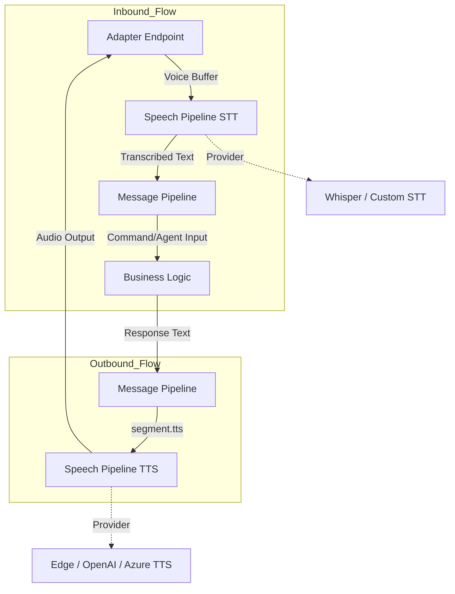
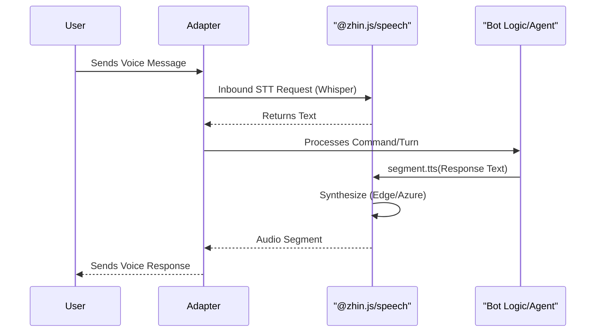

[英文原文](/en/wiki/cubic/speech)

::: warning 第三方生成的参考快照
[Cubic 原页面](https://www.cubic.dev/wikis/zhinjs/zhin?page=page-speech) · 抓取于 2026-09-23 · [源码提交](https://github.com/zhinjs/zhin/commit/368db14caa4aa91311fb090f07bd792fe4b22fe7)。本页由英文快照机器辅助翻译，尚未逐页与当前代码核验；实际开发请以[维护中的 Zhin 文档](/getting-started/)和[知识库勘误](/wiki/)为准。
:::

::: danger 已确认勘误
Cubic 原文中的部分源码引用行号在固定提交上指向无关内容。请查看链接的文件，不要只依赖行号范围。参见[语音文档](/ai/speech)。
:::

::: details 相关源文件

以下文件是 Cubic 生成本页时引用的上下文：

- [packages/toolkit/speech/package.json](https://github.com/zhinjs/zhin/blob/368db14caa4aa91311fb090f07bd792fe4b22fe7/packages/toolkit/speech/package.json)
- [README.md](https://github.com/zhinjs/zhin/blob/368db14caa4aa91311fb090f07bd792fe4b22fe7/README.md)
- [README.zh-CN.md](https://github.com/zhinjs/zhin/blob/368db14caa4aa91311fb090f07bd792fe4b22fe7/README.zh-CN.md)
- [AGENTS.md](https://github.com/zhinjs/zhin/blob/368db14caa4aa91311fb090f07bd792fe4b22fe7/AGENTS.md)
- [CLAUDE.md](https://github.com/zhinjs/zhin/blob/368db14caa4aa91311fb090f07bd792fe4b22fe7/CLAUDE.md)
- [packages/toolkit/scaffold-wizard/README.md](https://github.com/zhinjs/zhin/blob/368db14caa4aa91311fb090f07bd792fe4b22fe7/packages/toolkit/scaffold-wizard/README.md)
:::

# 语音链路（STT 与 TTS）

Zhin.js 中的语音管道提供了可选的语音识别（STT）和文本转语音（TTS）功能。它使多通道机器人能够处理入站语音数据，并生成出站音频响应。该系统以模块化“层级”形式运行，仅在产品需求需要丰富的媒体交互时才需安装。

来源：[README.md:92-99](https://github.com/zhinjs/zhin/blob/368db14caa4aa91311fb090f07bd792fe4b22fe7/README.md#L92-L99), [README.zh-CN.md:123](https://github.com/zhinjs/zhin/blob/368db14caa4aa91311fb090f07bd792fe4b22fe7/README.zh-CN.md#L123)

## 架构与数据流

语音模块直接集成到 Zhin.js 消息管道中。当启用时，它会拦截传入的音频片段进行转录，并将传出的文本片段转换为可播放的音频格式。


示意图展示了语音段如何通过语音工具包，在外部适配器和内部消息管道之间流动。
来源：[README.md:83-91](https://github.com/zhinjs/zhin/blob/368db14caa4aa91311fb090f07bd792fe4b22fe7/README.md#L83-L91), [packages/toolkit/speech/package.json:20-22](https://github.com/zhinjs/zhin/blob/368db14caa4aa91311fb090f07bd792fe4b22fe7/packages/toolkit/speech/package.json#L20-L22)

### 按层级划分的能力
语音服务归属于能力地图中的“连接”界面。如果缺少 `@zhin.js/speech` 包，系统将发出警告，并降级为标准文本处理。

来源：[README.md:104-106](https://github.com/zhinjs/zhin/blob/368db14caa4aa91311fb090f07bd792fe4b22fe7/README.md#L104-L106), [README.zh-CN.md:123](https://github.com/zhinjs/zhin/blob/368db14caa4aa91311fb090f07bd792fe4b22fe7/README.zh-CN.md#L123)

## 组件和提供者

语音管道支持多种行业标准引擎。这些引擎通过 `@zhin.js/speech` 包进行管理，该包列出了核心语音关键词，例如 Whisper 和 Edge-TTS。

| 特性 | 描述 | 支持的引擎 |
| :--- | :--- | :--- |
| **语音识别（STT）** | 入站语音转文本的转录。 | Whisper，自定义提供者 |
| **文本转语音（TTS）** | 出站文本转语音的合成。 | Edge-TTS，OpenAI，Azure，自定义 |
| **音频分段** | 消息管道中的音频分段处理。 | `segment.tts` |

来源：[packages/toolkit/speech/package.json:20-22](https://github.com/zhinjs/zhin/blob/368db14caa4aa91311fb090f07bd792fe4b22fe7/packages/toolkit/speech/package.json#L20-L22), [README.zh-CN.md:123](https://github.com/zhinjs/zhin/blob/368db14caa4aa91311fb090f07bd792fe4b22fe7/README.zh-CN.md#L123)

## 安装与集成

语音模块是一项高级功能，会为生产版本增加约几兆字节的大小。该模块未包含在默认的 `<10MB` IM 核心安装包中。

### 依赖管理
要启用语音功能，您必须在项目中添加语音工具包：
```bash
pnpm add @zhin.js/speech
```
该包需要 `@zhin.js/core` 作为依赖项，并使用 TypeScript 和 ESM 模块编写。

来源：[README.md:126](https://github.com/zhinjs/zhin/blob/368db14caa4aa91311fb090f07bd792fe4b22fe7/README.md#L126), [packages/toolkit/speech/package.json:1-12](https://github.com/zhinjs/zhin/blob/368db14caa4aa91311fb090f07bd792fe4b22fe7/packages/toolkit/speech/package.json#L1-L12), [packages/toolkit/speech/package.json:28-34](https://github.com/zhinjs/zhin/blob/368db14caa4aa91311fb090f07bd792fe4b22fe7/packages/toolkit/speech/package.json#L28-L34)

### 集成流程
以下流程展示了典型语音交互的交互过程：


来源：[README.md:83-91](https://github.com/zhinjs/zhin/blob/368db14caa4aa91311fb090f07bd792fe4b22fe7/README.md#L83-L91), [README.zh-CN.md:123](https://github.com/zhinjs/zhin/blob/368db14caa4aa91311fb090f07bd792fe4b22fe7/README.zh-CN.md#L123)

## 配置摘要

虽然各个提供者的主配置通过标准的 Zhin.js 配置投影来处理，但语音模块本身被定义为一个工具包。

| 配置元素 | 作用 | 参考文件 |
| :--- | :--- | :--- |
| `@zhin.js/speech` | 语音功能的入口点。 | `packages/toolkit/speech/package.json` |
| `segment.tts` | 触发合成的主要 UI 组件。 | `README.md` |
| `Connect` Surface | 管理适配器和语音集成规则。 | `README.md` |

来源：[README.md:104-106](https://github.com/zhinjs/zhin/blob/368db14caa4aa91311fb090f07bd792fe4b22fe7/README.md#L104-L106), [packages/toolkit/speech/package.json:1-5](https://github.com/zhinjs/zhin/blob/368db14caa4aa91311fb090f07bd792fe4b22fe7/packages/toolkit/speech/package.json#L1-L5)

## 结论

Zhin.js 语音管道为基于音频的机器人交互提供了一种可扩展的解决方案。通过将语音识别（STT）和语音合成（TTS）功能分离到 `@zhin.js/speech` 工具包中，该框架保持了轻量级的核心结构，同时实现了与 Whisper 和 Edge-TTS 等专业音频转录与合成引擎的深度集成。如果模块未安装，框架将通过优雅降级到文本交互来确保系统的稳定性。

来源：[README.md:92-99](https://github.com/zhinjs/zhin/blob/368db14caa4aa91311fb090f07bd792fe4b22fe7/README.md#L92-L99), [README.zh-CN.md:123](https://github.com/zhinjs/zhin/blob/368db14caa4aa91311fb090f07bd792fe4b22fe7/README.zh-CN.md#L123)
