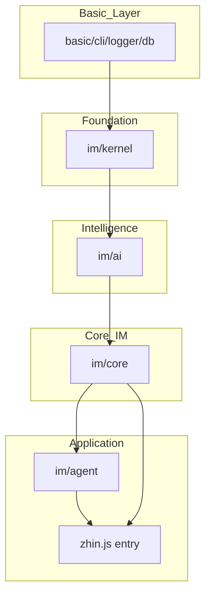
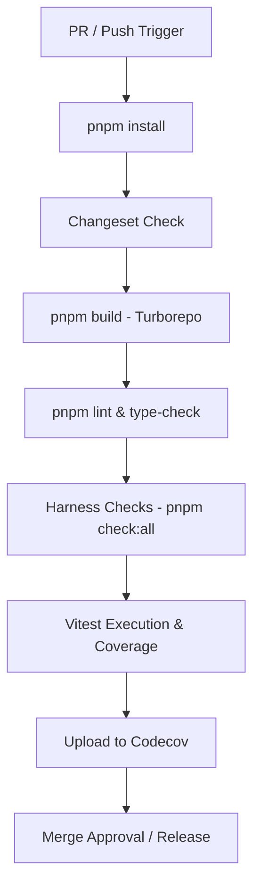

[英文原文](/en/wiki/cubic/testing)

::: warning 第三方生成的参考快照
[Cubic 原页面](https://www.cubic.dev/wikis/zhinjs/zhin?page=page-testing) · 抓取于 2026-09-23 · [源码提交](https://github.com/zhinjs/zhin/commit/368db14caa4aa91311fb090f07bd792fe4b22fe7)。本页由英文快照机器辅助翻译，尚未逐页与当前代码核验；实际开发请以[维护中的 Zhin 文档](/getting-started/)和[资料存档勘误](/wiki/archive)为准。
:::

::: details 相关源文件

以下文件是 Cubic 生成本页时引用的上下文：

- [CLAUDE.md](https://github.com/zhinjs/zhin/blob/368db14caa4aa91311fb090f07bd792fe4b22fe7/CLAUDE.md)
- [AGENTS.md](https://github.com/zhinjs/zhin/blob/368db14caa4aa91311fb090f07bd792fe4b22fe7/AGENTS.md)
- [basic/cli/TEST_GENERATION.md](https://github.com/zhinjs/zhin/blob/368db14caa4aa91311fb090f07bd792fe4b22fe7/basic/cli/TEST_GENERATION.md)
- [agents/tester/system.md](https://github.com/zhinjs/zhin/blob/368db14caa4aa91311fb090f07bd792fe4b22fe7/agents/tester/system.md)
- [agents/ops/system.md](https://github.com/zhinjs/zhin/blob/368db14caa4aa91311fb090f07bd792fe4b22fe7/agents/ops/system.md)
- [packages/toolkit/create-zhin/template/skills/plugin-publish/SKILL.md](https://github.com/zhinjs/zhin/blob/368db14caa4aa91311fb090f07bd792fe4b22fe7/packages/toolkit/create-zhin/template/skills/plugin-publish/SKILL.md)
- [packages/im/runtime/tests/console-feature-hmr.test.ts](https://github.com/zhinjs/zhin/blob/368db14caa4aa91311fb090f07bd792fe4b22fe7/packages/im/runtime/tests/console-feature-hmr.test.ts)
- [packages/im/agent/tests/plugin-runtime/native-knowledge-tool.test.ts](https://github.com/zhinjs/zhin/blob/368db14caa4aa91311fb090f07bd792fe4b22fe7/packages/im/agent/tests/plugin-runtime/native-knowledge-tool.test.ts)
:::

# 测试与 CI 门禁

Zhin.js 实现了一种分层的测试和持续集成（CI）框架，用于维护框架的稳定性、强制执行架构边界，并确保插件质量。该框架结合了 Vitest 用于单元/集成测试，以及 Turborepo 用于有序构建和自定义自动化检查，这些检查构成项目的 Harness 工程。

来源：[CLAUDE.md:120-130](https://github.com/zhinjs/zhin/blob/368db14caa4aa91311fb090f07bd792fe4b22fe7/CLAUDE.md#L120-L130), [AGENTS.md:60-75](https://github.com/zhinjs/zhin/blob/368db14caa4aa91311fb090f07bd792fe4b22fe7/AGENTS.md#L60-L75)

## 测试框架与执行

Zhin.js 使用 **Vitest 4.x** 作为其主要测试框架。该环境默认启用全局变量，因此在测试文件中无需导入 `describe`、`it` 或 `expect`。测试在 `node` 环境中运行，且默认超时时间为 10 秒。

来源：[CLAUDE.md:105-115](https://github.com/zhinjs/zhin/blob/368db14caa4aa91311fb090f07bd792fe4b22fe7/CLAUDE.md#L105-L115), [basic/cli/TEST_GENERATION.md:175-185](https://github.com/zhinjs/zhin/blob/368db14caa4aa91311fb090f07bd792fe4b22fe7/basic/cli/TEST_GENERATION.md#L175-L185)

### 关键测试执行命令

| 命令 | 操作 |
|------|------|
| `pnpm test` | 在工作区中运行所有 Vitest 测试 |
| `pnpm test:watch` | 启动 Vitest 监听模式 |
| `pnpm test:coverage` | 生成代码覆盖率报告（v8 提供商） |
| `pnpm --filter <pkg> test` | 运行特定包的测试 |

来源：[CLAUDE.md:17-25](https://github.com/zhinjs/zhin/blob/368db14caa4aa91311fb090f07bd792fe4b22fe7/CLAUDE.md#L17-L25), [basic/cli/TEST_GENERATION.md:180-190](https://github.com/zhinjs/zhin/blob/368db14caa4aa91311fb090f07bd792fe4b22fe7/basic/cli/TEST_GENERATION.md#L180-L190)

### 覆盖率阈值
项目强制执行最低覆盖率要求，以确保代码的可靠性：
- **行覆盖率**：45%
- **分支覆盖率**：35%
插件通常目标为60-70%的基础覆盖率，关键组件的目标达到90%以上。

来源：[CLAUDE.md:113-114](https://github.com/zhinjs/zhin/blob/368db14caa4aa91311fb090f07bd792fe4b22fe7/CLAUDE.md#L113-L114), [basic/cli/TEST_GENERATION.md:195-200](https://github.com/zhinjs/zhin/blob/368db14caa4aa91311fb090f07bd792fe4b22fe7/basic/cli/TEST_GENERATION.md#L195-L200), [packages/toolkit/create-zhin/template/skills/plugin-publish/SKILL.md:65-70](https://github.com/zhinjs/zhin/blob/368db14caa4aa91311fb090f07bd792fe4b22fe7/packages/toolkit/create-zhin/template/skills/plugin-publish/SKILL.md#L65-L70)

## 架构与依赖管理

该机制强制实施单向依赖流，以防止循环依赖和架构退化。层级结构从基础到应用层层递进：`basic → kernel → ai → core → agent → zhin`。

来源：[CLAUDE.md:65-75](https://github.com/zhinjs/zhin/blob/368db14caa4aa91311fb090f07bd792fe4b22fe7/CLAUDE.md#L65-L75), [AGENTS.md:70-80](https://github.com/zhinjs/zhin/blob/368db14caa4aa91311fb090f07bd792fe4b22fe7/AGENTS.md#L70-L80)

### 架构依赖流

示意图表示了强制性的依赖方向，即较低层不得从较高层导入。来源：[CLAUDE.md:65-75](https://github.com/zhinjs/zhin/blob/368db14caa4aa91311fb090f07bd792fe4b22fe7/CLAUDE.md#L65-L75)，[AGENTS.md:70-80](https://github.com/zhinjs/zhin/blob/368db14caa4aa91311fb090f07bd792fe4b22fe7/AGENTS.md#L70-L80)

### 自定义 Harness 门禁
`pnpm check:all` 命令执行各种专用脚本以验证仓库约束：
- `check:architecture`：验证没有包违反依赖层级。
- `check:harness-paths`：检测绕过 `Adapter.sendMessage` 直接调用内部机器人方法的插件。
- `check:no-koa`：确保插件使用框架的 `RouterContext` 而非直接导入 Koa。
- `check:install-size`：验证核心 IM 生产版本的 `node_modules` 大小不超过 10MB。
- `check:plugin`：确认插件包含必需文件（package.json、README、src、tests）。

来源：[CLAUDE.md:30-45](https://github.com/zhinjs/zhin/blob/368db14caa4aa91311fb090f07bd792fe4b22fe7/CLAUDE.md#L30-L45), [AGENTS.md:85-95](https://github.com/zhinjs/zhin/blob/368db14caa4aa91311fb090f07bd792fe4b22fe7/AGENTS.md#L85-L95)

## CI/CD 流水线及 GitHub Actions

GitHub Actions 通过 `ci.yml` 中定义的流程来管理 CI 生命周期。该流水线在每次 Pull Request 以及推送至 `main` 分支时都会运行，并使用矩阵方式在多个 Node.js 版本（22、24、26）和操作系统（Ubuntu、Windows）上进行测试。

来源：[CLAUDE.md:120-128](https://github.com/zhinjs/zhin/blob/368db14caa4aa91311fb090f07bd792fe4b22fe7/CLAUDE.md#L120-L128), [agents/ops/system.md:15-25](https://github.com/zhinjs/zhin/blob/368db14caa4aa91311fb090f07bd792fe4b22fe7/agents/ops/system.md#L15-L25)

### CI 流水线序列

该流程图展示了在 Zhin 环境中，代码变更需经过哪些顺序门禁才能被视为稳定。来源：[CLAUDE.md:120-130](https://github.com/zhinjs/zhin/blob/368db14caa4aa91311fb090f07bd792fe4b22fe7/CLAUDE.md#L120-L130)，[agents/ops/system.md:15-25](https://github.com/zhinjs/zhin/blob/368db14caa4aa91311fb090f07bd792fe4b22fe7/agents/ops/system.md#L15-L25)

## 自动化测试生成

Zhin CLI 通过 `zhin new` 命令提供自动化测试套件生成功能。当你创建新的插件、服务或适配器时，CLI 会自动生成一个包含相关模板代码的 `tests/index.test.ts` 文件。

来源：[basic/cli/TEST_GENERATION.md:5-15](https://github.com/zhinjs/zhin/blob/368db14caa4aa91311fb090f07bd792fe4b22fe7/basic/cli/TEST_GENERATION.md#L5-L15)

### 模板功能
- **插件**：包含生命周期测试（启动/停止）、实例验证以及中间件执行。
- **适配器**：模拟端点以测试消息的接收、发送以及生命周期事件（如 `message.receive`）。
- **服务**：生成依赖注入和方法执行测试的占位符。

来源：[basic/cli/TEST_GENERATION.md:25-90](https://github.com/zhinjs/zhin/blob/368db14caa4aa91311fb090f07bd792fe4b22fe7/basic/cli/TEST_GENERATION.md#L25-L90)

## 质量控制与发布角色

Harness 体系包含专门的 AI Agent 角色用于监控和维护质量：

1. **测试代理（Tester Agent）**：对拉取请求（PR）进行功能验证，为边缘情况设计测试用例，并在验证失败时提供结构化的缺陷报告。来源：[agents/tester/system.md:5-15](https://github.com/zhinjs/zhin/blob/368db14caa4aa91311fb090f07bd792fe4b22fe7/agents/tester/system.md#L5-L15)
2. **运维代理（Ops Agent）**：监控工作流状态，管理版本标签（v{major}.{minor}.{patch}），并确保环境变量和密钥不会泄露到CI日志中。来源：[agents/ops/system.md:5-15](https://github.com/zhinjs/zhin/blob/368db14caa4aa91311fb090f07bd792fe4b22fe7/agents/ops/system.md#L5-L15)

### 发布准备检查清单

在发布插件之前，Harness 门禁要求满足以下条件：
- `pnpm build`（tsc）编译通过，且无错误。
- 所有测试均通过，且覆盖率充足（≥60%）。
- `npm pack --dry-run` 确认存在 `lib/`、`src/` 和 `skills/` 目录。
- 不存在敏感密钥出现在 `.env` 或配置文件中。

来源：[packages/toolkit/create-zhin/template/skills/plugin-publish/SKILL.md:40-100](https://github.com/zhinjs/zhin/blob/368db14caa4aa91311fb090f07bd792fe4b22fe7/packages/toolkit/create-zhin/template/skills/plugin-publish/SKILL.md#L40-L100)

Zhin.js 的测试和持续集成（CI）重点在于早期发现架构违规问题，并确保每个插件都能通过自动化生成和严格的 CI 门禁，提供基本的验证保障。

来源：[CLAUDE.md:130-135](https://github.com/zhinjs/zhin/blob/368db14caa4aa91311fb090f07bd792fe4b22fe7/CLAUDE.md#L130-L135), [AGENTS.md:65](https://github.com/zhinjs/zhin/blob/368db14caa4aa91311fb090f07bd792fe4b22fe7/AGENTS.md#L65)
