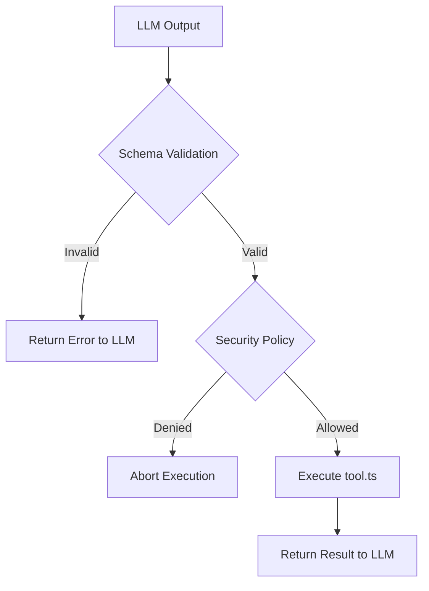
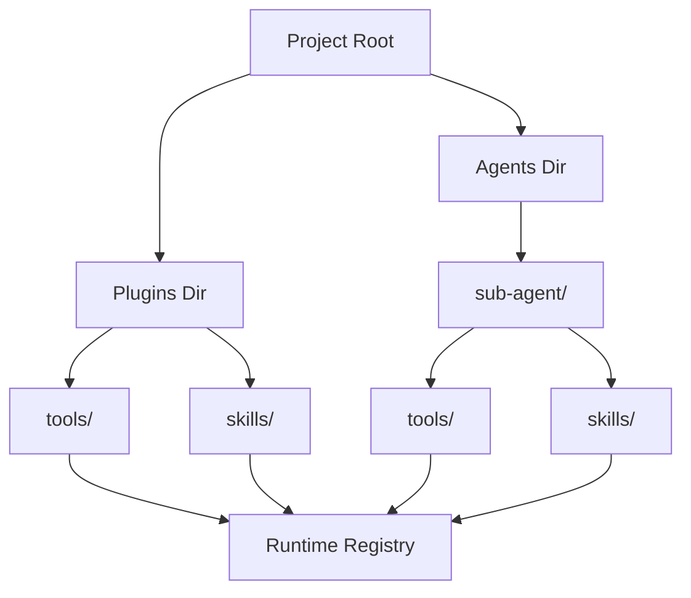

[英文原文](/en/wiki/cubic/tools-caps)

::: warning 第三方生成的参考快照
[Cubic 原页面](https://www.cubic.dev/wikis/zhinjs/zhin?page=page-tools-caps) · 抓取于 2026-09-23 · [源码提交](https://github.com/zhinjs/zhin/commit/368db14caa4aa91311fb090f07bd792fe4b22fe7)。本页由英文快照机器辅助翻译，尚未逐页与当前代码核验；实际开发请以[维护中的 Zhin 文档](/getting-started/)和[知识库勘误](/wiki/)为准。
:::

::: details 相关源文件

以下文件是 Cubic 生成本页时引用的上下文：

- [packages/im/agent-feature/src/definition.ts](https://github.com/zhinjs/zhin/blob/368db14caa4aa91311fb090f07bd792fe4b22fe7/packages/im/agent-feature/src/definition.ts)
- [packages/im/agent/src/discovery/agent-surface-info.ts](https://github.com/zhinjs/zhin/blob/368db14caa4aa91311fb090f07bd792fe4b22fe7/packages/im/agent/src/discovery/agent-surface-info.ts)
- [packages/toolkit/create-zhin/template/skills/skill-creator/SKILL.md](https://github.com/zhinjs/zhin/blob/368db14caa4aa91311fb090f07bd792fe4b22fe7/packages/toolkit/create-zhin/template/skills/skill-creator/SKILL.md)
- [packages/toolkit/create-zhin/template/skills/plugin-develop/SKILL.md](https://github.com/zhinjs/zhin/blob/368db14caa4aa91311fb090f07bd792fe4b22fe7/packages/toolkit/create-zhin/template/skills/plugin-develop/SKILL.md)
- [AGENTS.md](https://github.com/zhinjs/zhin/blob/368db14caa4aa91311fb090f07bd792fe4b22fe7/AGENTS.md)
- [packages/im/agent/tests/agent-definition-enhancements.test.ts](https://github.com/zhinjs/zhin/blob/368db14caa4aa91311fb090f07bd792fe4b22fe7/packages/im/agent/tests/agent-definition-enhancements.test.ts)
:::

# Agent 工具与能力

Agent 工具和能力为 Zhin.js 框架中的 AI Agent 提供了功能接口。它们使 Agent 能够与外部环境交互、执行逻辑，并遵循可重复的工作流。这些能力由一个中心化的运行时管理，负责发现、安全策略以及执行生命周期的管理。

系统将 **工具**（功能代码单元）和 **技能**（基于 Markdown 的可重复工作流）区分开来。两者均通过插件或主项目工作空间内的约定式目录结构进行发现。

## Agent 工具

工具是 Agent 执行操作的主要机制。您使用 `defineAgentTool()` 函数来定义一个工具，该函数需要提供描述和输入模式。

### 工具结构与定义
每个工具作为一个独立的模块存在，通常位于一个 `tools/<name>/index.ts` 文件中。运行时会使用 `inputSchema` 来验证 LLM 生成的参数在执行前的正确性。


该图展示了在工具执行其内部逻辑之前所需进行的验证和安全检查点。
来源：[packages/toolkit/create-zhin/template/skills/plugin-develop/SKILL.md:59-71](https://github.com/zhinjs/zhin/blob/368db14caa4aa91311fb090f07bd792fe4b22fe7/packages/toolkit/create-zhin/template/skills/plugin-develop/SKILL.md#L59-L71), [AGENTS.md:144-150](https://github.com/zhinjs/zhin/blob/368db14caa4aa91311fb090f07bd792fe4b22fe7/AGENTS.md#L144-L150)

### 关键工具组件
| 组件 | 描述 |
| :--- | :--- |
| **描述** | 一段简洁的文字，说明该工具的功能以及代理在什么情况下应使用它。 |
| **输入模式** | 一个 Zod 或 JSON 模式，定义了预期的参数。 |
| **执行函数** | 执行具体任务的异步逻辑，返回字符串或对象。 |
| **安全策略** | 元数据，定义该工具是否需要用户批准（`ask`）或遵循白名单规则。 |

来源：[packages/toolkit/create-zhin/template/skills/plugin-develop/SKILL.md:59-71](https://github.com/zhinjs/zhin/blob/368db14caa4aa91311fb090f07bd792fe4b22fe7/packages/toolkit/create-zhin/template/skills/plugin-develop/SKILL.md#L59-L71), [AGENTS.md:144-150](https://github.com/zhinjs/zhin/blob/368db14caa4aa91311fb090f07bd792fe4b22fe7/AGENTS.md#L144-L150)

## Agent Skills

技能代表可重复、可搜索和可执行的工作流，以 Markdown（`SKILL.md`）形式定义。与工具不同，技能侧重于操作流程和步骤顺序，而非原始执行逻辑。

### 技能定义
一个技能包包含前端元数据和结构化的 Markdown 内容。前端元数据中的 `name` 必须与目录名称一致。

```yaml
---
name: my-skill
description: "Used when the user asks for X. Triggers: keywords"
keywords: [keyword1, keyword2]
tags: [zhin, plugin]
---
```
来源：[packages/toolkit/create-zhin/template/skills/skill-creator/SKILL.md:30-41](https://github.com/zhinjs/zhin/blob/368db14caa4aa91311fb090f07bd792fe4b22fe7/packages/toolkit/create-zhin/template/skills/skill-creator/SKILL.md#L30-L41)

### 技能工作流要求
- **触发条件**：明确的关键词和描述标记，有助于激活该技能。
- **步骤编号**：一套分步指令，明确指定输入、操作和输出。
- **失败处理与降级方案**：一个表格或列表，说明在特定步骤失败时应采取的措施。
- **限制条件**：一个“禁止做什么”的部分，以防止幻觉或不当工具使用。

来源：[packages/toolkit/create-zhin/template/skills/skill-creator/SKILL.md:43-60](https://github.com/zhinjs/zhin/blob/368db14caa4aa91311fb090f07bd792fe4b22fe7/packages/toolkit/create-zhin/template/skills/skill-creator/SKILL.md#L43-L60)

## 发现与架构

Zhin.js 运行时会扫描特定目录以注册能力。这种基于约定的发现机制支持热重载（HMR）和模块化扩展。

### 能力发现流程

发现机制会注册全局能力以及位于特定代理目录中的私有代理能力。
来源：[packages/im/agent/src/discovery/agent-surface-info.ts:60-84](https://github.com/zhinjs/zhin/blob/368db14caa4aa91311fb090f07bd792fe4b22fe7/packages/im/agent/src/discovery/agent-surface-info.ts#L60-L84), [packages/im/agent-feature/README.md:1-25](https://github.com/zhinjs/zhin/blob/368db14caa4aa91311fb090f07bd792fe4b22fe7/packages/im/agent-feature/README.md#L1-L25)

### 作用域访问
根据当前上下文逐步披露能力：
1. **全局工具**：位于项目根目录或插件根目录的 `tools/`。
2. **技能私有工具**：位于 `skills/<name>/tools/`；仅在技能激活时披露。
3. **代理私有工具**：位于 `agents/<name>/tools/`；仅向特定代理披露。

来源：[CLAUDE.md:88-96](https://github.com/zhinjs/zhin/blob/368db14caa4aa91311fb090f07bd792fe4b22fe7/CLAUDE.md#L88-L96), [packages/im/agent-feature/README.md:27-40](https://github.com/zhinjs/zhin/blob/368db14caa4aa91311fb090f07bd792fe4b22fe7/packages/im/agent-feature/README.md#L27-L40)

## Agent 定义与配置

Agent 由一个 `agent.json`  manifest 和核心 Markdown 文件定义。该 manifest 控制 Agent 的行为、迭代限制以及允许的能力。

### Agent Manifest 字段
| 字段 | 类型 | 描述 |
| :--- | :--- | :--- |
| `name` | `string` | 稳定能力 ID（kebab-case 格式）。 |
| `trigger_rules` | `object` | 触发该 Agent 的关键词和文件模式。 |
| `entry_points` | `string[]` | 必须包含 `system.md`、`boundaries.md` 和 `conventions.md`。 |
| `disallowed_tools` | `string[]` | Agent 被禁止使用的工具列表。 |
| `max_iterations` | `number` | 工具调用循环的限制（默认值根据努力级别而异）。 |
| `effort` | `enum` | 迭代预算：`low`（3）、`medium`（5）、`high`（10）、`max`（20）。 |

来源：[packages/im/agent-feature/src/definition.ts:25-56](https://github.com/zhinjs/zhin/blob/368db14caa4aa91311fb090f07bd792fe4b22fe7/packages/im/agent-feature/src/definition.ts#L25-L56), [packages/im/agent/tests/agent-definition-enhancements.test.ts:79-88](https://github.com/zhinjs/zhin/blob/368db14caa4aa91311fb090f07bd792fe4b22fe7/packages/im/agent/tests/agent-definition-enhancements.test.ts#L79-L88)

### 安全与治理
运行时通过多层机制确保安全：
- **执行策略**：通过 `execSecurity`（例如 `allowlist`）和 `execApprovalMode`（例如 `ask`）进行控制。
- **文件与网络策略**：限制对敏感文件或未经授权域名的访问。
- **子代理过滤**：子代理会自动阻止危险工具（如 `spawn_task`）的使用，除非明确授权。

来源：[AGENTS.md:144-150](https://github.com/zhinjs/zhin/blob/368db14caa4aa91311fb090f07bd792fe4b22fe7/AGENTS.md#L144-L150), [packages/im/agent/tests/agent-definition-enhancements.test.ts:16-25](https://github.com/zhinjs/zhin/blob/368db14caa4aa91311fb090f07bd792fe4b22fe7/packages/im/agent/tests/agent-definition-enhancements.test.ts#L16-L25)

## 实现摘要

代理能力被集成到消息处理流程中。当接收到消息时，`ZhinAgent` 协调器将确定合适的代理，根据关键词激活相应的技能，并在安全的沙箱环境中管理工具调用循环。工具和技能的模块化设计确保了特定插件逻辑与核心IM运行时解耦。
