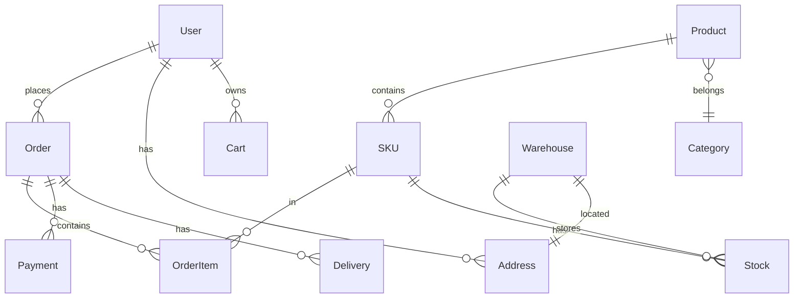
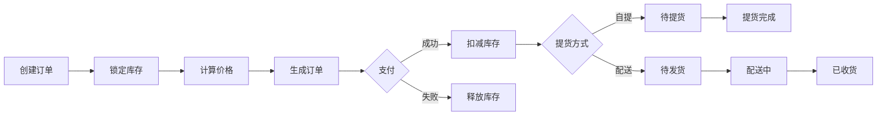
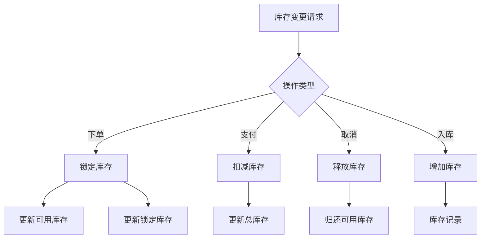

# 建材商城系统架构设计文档

> 作者：架构师团队  
> 日期：2026-01-20  
> 版本：v1.0

## 📋 目录

- [1. 系统概述](#1-系统概述)
- [2. 核心功能模块](#2-核心功能模块)
- [3. 技术架构](#3-技术架构)
- [4. 数据模型](#4-数据模型)
- [5. 接口设计](#5-接口设计)

---

## 1. 系统概述

### 1.1 业务背景
建材行业具有**大宗采购、批量交易、仓储物流复杂**的特点，需要构建一套适合 B2B/B2C 混合模式的电商系统。

### 1.2 系统定位
- **C端**：个人用户、小微企业采购
- **B端**：企业批量采购、供应商管理
- **运营端**：平台运营、仓储管理、财务结算

---

## 2. 核心功能模块

### 📦 2.1 您已列出的模块（13个）✅

#### ✅ 已确认模块清单

| 序号 | 模块名称 | 归属系统 | 优先级 |
|------|---------|---------|--------|
| 1 | 用户管理 | 用户中心 | P0 |
| 2 | 角色管理 | 权限中心 | P0 |
| 3 | 商品管理 | 商品中心 | P0 |
| 4 | 商品单位管理 | 基础数据 | P1 |
| 5 | 仓库管理 | 仓储中心 | P0 |
| 6 | 库存管理 | 库存中心 | P0 |
| 7 | 订单管理 | 订单中心 | P0 |
| 8 | 代金券管理 | 营销中心 | P1 |
| 9 | 会员卡管理 | 会员中心 | P1 |
| 10 | 商品分类管理 | 商品中心 | P0 |
| 11 | 商品规格管理 | 商品中心 | P0 |
| 12 | 地址管理 | 地址服务 | P0 |
| 13 | 配送管理 | 物流中心 | P0 |

---

### 🎯 2.2 建议补充的关键模块（14个）

#### 💰 **财务结算模块**（必须）
```
14. 支付管理
    - 支付渠道：微信、支付宝、企业网银、账期支付
    - 支付单、退款单、支付回调处理
    - 支付状态机、对账系统

15. 财务结算
    - 订单结算、供应商结算、物流结算
    - 账单生成、发票开具、账期管理
    - 财务报表、利润分析
```

#### 🏢 **企业采购模块**（建材行业特色）
```
16. 企业认证
    - 企业资质审核、三证合一
    - 企业额度管理、信用评级
    - 企业账号体系、子账号管理

17. 批量采购
    - 批量询价、报价单管理
    - 合同管理、框架协议
    - 账期支付、月结季结

18. 采购审批
    - 采购申请、多级审批
    - 预算管理、额度控制
    - 审批流程引擎
```

#### 🚚 **供应链管理模块**
```
19. 供应商管理
    - 供应商入驻、资质审核
    - 供应商评级、考核
    - 供应商结算、对账

20. 采购管理
    - 采购计划、采购订单
    - 供应商询价、比价
    - 到货验收、质检

21. 调拨管理
    - 仓库间调拨、在途库存
    - 调拨单、出入库单
    - 物流跟踪
```

#### 📊 **数据分析模块**
```
22. 数据统计
    - 销售统计、库存统计
    - 用户行为分析、转化分析
    - 商品销量排行、品类分析

23. 数据大屏
    - 实时交易大屏、库存看板
    - 物流配送大屏、运营监控
    - 可视化图表、趋势分析

24. 报表中心
    - 销售报表、财务报表
    - 库存报表、物流报表
    - 自定义报表、导出功能
```

#### 🔔 **消息通知模块**
```
25. 消息中心
    - 站内消息、推送通知
    - 短信通知、邮件通知
    - 消息模板、消息队列

26. 工作流通知
    - 订单状态通知、物流通知
    - 库存预警、到期提醒
    - 审批通知、异常报警
```

#### 🎁 **营销推广模块**（扩展）
```
27. 活动管理
    - 秒杀、团购、预售
    - 满减、满赠、折扣
    - 活动配置、时间调度

28. 积分商城
    - 积分规则、积分兑换
    - 积分商品、积分订单
    - 积分流水、过期回收
```

#### ⚙️ **系统管理模块**
```
29. 系统配置
    - 参数配置、字典管理
    - 区域管理、物流公司
    - 支付配置、短信配置

30. 日志审计
    - 操作日志、访问日志
    - 错误日志、性能日志
    - 审计追踪、合规管理

31. 定时任务
    - 订单自动取消、库存同步
    - 数据统计、报表生成
    - 任务调度、监控告警
```

---

## 3. 技术架构

### 3.1 整体架构图

```
┌─────────────────────────────────────────────────────────────┐
│                         客户端层                              │
│  ┌──────────┐  ┌──────────┐  ┌──────────┐  ┌──────────┐   │
│  │  iOS App │  │Android App│  │  H5/小程序 │  │ 管理后台  │   │
│  └──────────┘  └──────────┘  └──────────┘  └──────────┘   │
└─────────────────────────────────────────────────────────────┘
                              ↓
┌─────────────────────────────────────────────────────────────┐
│                       API 网关层                              │
│       ┌─────────────────────────────────────────┐           │
│       │  鉴权 │ 限流 │ 路由 │ 负载均衡 │ 熔断    │           │
│       └─────────────────────────────────────────┘           │
└─────────────────────────────────────────────────────────────┘
                              ↓
┌─────────────────────────────────────────────────────────────┐
│                       业务服务层                              │
│  ┌──────────┐  ┌──────────┐  ┌──────────┐  ┌──────────┐   │
│  │ 用户服务  │  │ 商品服务  │  │ 订单服务  │  │ 支付服务  │   │
│  └──────────┘  └──────────┘  └──────────┘  └──────────┘   │
│  ┌──────────┐  ┌──────────┐  ┌──────────┐  ┌──────────┐   │
│  │ 库存服务  │  │ 物流服务  │  │ 营销服务  │  │ 消息服务  │   │
│  └──────────┘  └──────────┘  └──────────┘  └──────────┘   │
└─────────────────────────────────────────────────────────────┘
                              ↓
┌─────────────────────────────────────────────────────────────┐
│                       数据服务层                              │
│  ┌──────────┐  ┌──────────┐  ┌──────────┐  ┌──────────┐   │
│  │  MySQL   │  │  Redis   │  │   MQ     │  │   ES     │   │
│  └──────────┘  └──────────┘  └──────────┘  └──────────┘   │
└─────────────────────────────────────────────────────────────┘
```

### 3.2 技术栈建议

#### 前端技术栈
```typescript
// 移动端
- iOS: Swift + SwiftUI
- Android: Kotlin + Jetpack Compose
- 跨平台: React Native / Flutter

// Web端
- 框架: React 18 + TypeScript
- 状态管理: Zustand / Redux Toolkit
- UI组件: Ant Design / Material-UI
- 构建工具: Vite / Webpack 5
```

#### 后端技术栈
```typescript
// 主框架
- Node.js: NestJS + TypeScript
- Java: Spring Boot + Spring Cloud
- Go: Gin + gRPC

// 数据库
- 主库: MySQL 8.0 (分库分表)
- 缓存: Redis Cluster
- 搜索: ElasticSearch
- 消息队列: RabbitMQ / Kafka

// 中间件
- 网关: Kong / APISIX
- 服务注册: Nacos / Consul
- 配置中心: Apollo / Nacos
- 链路追踪: SkyWalking / Jaeger
```

---

## 4. 数据模型

### 4.1 核心实体关系



### 4.2 关键数据表设计

#### 用户表 (users)
```sql
CREATE TABLE users (
    id BIGINT PRIMARY KEY AUTO_INCREMENT,
    mobile VARCHAR(11) UNIQUE NOT NULL COMMENT '手机号',
    email VARCHAR(100) COMMENT '邮箱',
    nickname VARCHAR(50) COMMENT '昵称',
    avatar VARCHAR(255) COMMENT '头像',
    user_type TINYINT DEFAULT 1 COMMENT '用户类型: 1个人 2企业',
    status TINYINT DEFAULT 1 COMMENT '状态: 1正常 2禁用',
    created_at TIMESTAMP DEFAULT CURRENT_TIMESTAMP,
    updated_at TIMESTAMP DEFAULT CURRENT_TIMESTAMP ON UPDATE CURRENT_TIMESTAMP,
    INDEX idx_mobile (mobile),
    INDEX idx_status (status)
) ENGINE=InnoDB DEFAULT CHARSET=utf8mb4 COMMENT='用户表';
```

#### 商品表 (products)
```sql
CREATE TABLE products (
    id BIGINT PRIMARY KEY AUTO_INCREMENT,
    product_name VARCHAR(200) NOT NULL COMMENT '商品名称',
    product_code VARCHAR(50) UNIQUE COMMENT '商品编码',
    category_id BIGINT COMMENT '分类ID',
    brand VARCHAR(100) COMMENT '品牌',
    unit VARCHAR(20) COMMENT '单位',
    description TEXT COMMENT '商品描述',
    status TINYINT DEFAULT 1 COMMENT '状态: 1上架 2下架',
    created_at TIMESTAMP DEFAULT CURRENT_TIMESTAMP,
    updated_at TIMESTAMP DEFAULT CURRENT_TIMESTAMP ON UPDATE CURRENT_TIMESTAMP,
    INDEX idx_category (category_id),
    INDEX idx_status (status),
    FULLTEXT idx_name (product_name)
) ENGINE=InnoDB DEFAULT CHARSET=utf8mb4 COMMENT='商品表';
```

#### SKU表 (product_skus)
```sql
CREATE TABLE product_skus (
    id BIGINT PRIMARY KEY AUTO_INCREMENT,
    product_id BIGINT NOT NULL COMMENT '商品ID',
    sku_code VARCHAR(50) UNIQUE COMMENT 'SKU编码',
    sku_name VARCHAR(200) COMMENT 'SKU名称',
    spec_values JSON COMMENT '规格值 {"颜色":"红色","尺寸":"50kg"}',
    price DECIMAL(10,2) NOT NULL COMMENT '销售价',
    cost_price DECIMAL(10,2) COMMENT '成本价',
    stock INT DEFAULT 0 COMMENT '库存',
    status TINYINT DEFAULT 1 COMMENT '状态',
    created_at TIMESTAMP DEFAULT CURRENT_TIMESTAMP,
    updated_at TIMESTAMP DEFAULT CURRENT_TIMESTAMP ON UPDATE CURRENT_TIMESTAMP,
    INDEX idx_product (product_id),
    INDEX idx_status (status)
) ENGINE=InnoDB DEFAULT CHARSET=utf8mb4 COMMENT='SKU表';
```

#### 订单表 (orders)
```sql
CREATE TABLE orders (
    id BIGINT PRIMARY KEY AUTO_INCREMENT,
    order_no VARCHAR(32) UNIQUE NOT NULL COMMENT '订单号',
    user_id BIGINT NOT NULL COMMENT '用户ID',
    order_type TINYINT DEFAULT 1 COMMENT '订单类型: 1普通 2企业',
    total_amount DECIMAL(10,2) NOT NULL COMMENT '订单总额',
    discount_amount DECIMAL(10,2) DEFAULT 0 COMMENT '优惠金额',
    freight_amount DECIMAL(10,2) DEFAULT 0 COMMENT '运费',
    pay_amount DECIMAL(10,2) NOT NULL COMMENT '实付金额',
    order_status TINYINT DEFAULT 1 COMMENT '订单状态: 1待付款 2待发货 3待收货 4已完成 5已取消',
    pay_status TINYINT DEFAULT 0 COMMENT '支付状态: 0未支付 1已支付',
    delivery_type TINYINT COMMENT '提货方式: 1自提 2配送',
    address_id BIGINT COMMENT '地址ID',
    warehouse_id BIGINT COMMENT '仓库ID',
    remark TEXT COMMENT '备注',
    created_at TIMESTAMP DEFAULT CURRENT_TIMESTAMP,
    updated_at TIMESTAMP DEFAULT CURRENT_TIMESTAMP ON UPDATE CURRENT_TIMESTAMP,
    INDEX idx_user (user_id),
    INDEX idx_status (order_status, pay_status),
    INDEX idx_created (created_at)
) ENGINE=InnoDB DEFAULT CHARSET=utf8mb4 COMMENT='订单表';
```

#### 库存表 (stocks)
```sql
CREATE TABLE stocks (
    id BIGINT PRIMARY KEY AUTO_INCREMENT,
    sku_id BIGINT NOT NULL COMMENT 'SKU ID',
    warehouse_id BIGINT NOT NULL COMMENT '仓库ID',
    available_stock INT DEFAULT 0 COMMENT '可用库存',
    locked_stock INT DEFAULT 0 COMMENT '锁定库存',
    total_stock INT AS (available_stock + locked_stock) COMMENT '总库存',
    updated_at TIMESTAMP DEFAULT CURRENT_TIMESTAMP ON UPDATE CURRENT_TIMESTAMP,
    UNIQUE KEY uk_sku_warehouse (sku_id, warehouse_id),
    INDEX idx_warehouse (warehouse_id)
) ENGINE=InnoDB DEFAULT CHARSET=utf8mb4 COMMENT='库存表';
```

---

## 5. 接口设计

### 5.1 RESTful API 规范

```typescript
// 基础路径
https://api.example.com/v1

// 用户相关
POST   /auth/login          // 登录
POST   /auth/register       // 注册
POST   /auth/logout         // 登出
GET    /users/:id           // 获取用户信息
PUT    /users/:id           // 更新用户信息

// 商品相关
GET    /products            // 商品列表
GET    /products/:id        // 商品详情
POST   /products            // 创建商品(管理端)
PUT    /products/:id        // 更新商品(管理端)
DELETE /products/:id        // 删除商品(管理端)

// 订单相关
POST   /orders              // 创建订单
GET    /orders              // 订单列表
GET    /orders/:id          // 订单详情
PUT    /orders/:id/cancel   // 取消订单
PUT    /orders/:id/pay      // 支付订单

// 购物车相关
GET    /cart                // 购物车列表
POST   /cart/items          // 添加商品
PUT    /cart/items/:id      // 更新数量
DELETE /cart/items/:id      // 删除商品

// 地址相关
GET    /addresses           // 地址列表
POST   /addresses           // 创建地址
PUT    /addresses/:id       // 更新地址
DELETE /addresses/:id       // 删除地址
```

### 5.2 响应格式规范

```typescript
// 成功响应
{
  "code": 200,
  "message": "success",
  "data": {
    // 业务数据
  },
  "timestamp": 1642766400000
}

// 分页响应
{
  "code": 200,
  "message": "success",
  "data": {
    "list": [],
    "total": 100,
    "page": 1,
    "pageSize": 20
  }
}

// 错误响应
{
  "code": 400,
  "message": "参数错误",
  "errors": [
    {
      "field": "mobile",
      "message": "手机号格式不正确"
    }
  ],
  "timestamp": 1642766400000
}
```

---

## 6. 核心业务流程

### 6.1 订单流程



### 6.2 库存管理流程



---

## 7. 关键技术方案

### 7.1 库存一致性方案

**问题**：高并发下如何保证库存不超卖？

**方案**：
1. **数据库层**：使用乐观锁 + 版本号
2. **缓存层**：Redis 原子操作
3. **消息队列**：异步削峰

```sql
-- 乐观锁更新库存
UPDATE stocks 
SET available_stock = available_stock - :qty,
    locked_stock = locked_stock + :qty,
    version = version + 1
WHERE sku_id = :skuId 
  AND warehouse_id = :warehouseId
  AND available_stock >= :qty
  AND version = :version;
```

### 7.2 分布式事务方案

**方案选择**：SAGA 模式

```typescript
// 订单创建流程
class OrderSaga {
  async execute(orderData) {
    try {
      // 1. 创建订单
      const order = await this.orderService.create(orderData);
      
      // 2. 锁定库存
      await this.stockService.lock(order.items);
      
      // 3. 锁定优惠券
      await this.couponService.lock(order.couponId);
      
      // 4. 创建支付单
      await this.paymentService.create(order);
      
      return order;
    } catch (error) {
      // 补偿操作
      await this.compensate(order);
      throw error;
    }
  }
  
  async compensate(order) {
    // 释放库存
    await this.stockService.release(order.items);
    // 释放优惠券
    await this.couponService.release(order.couponId);
    // 取消订单
    await this.orderService.cancel(order.id);
  }
}
```

### 7.3 缓存策略

```typescript
// 缓存key设计
const CacheKey = {
  // 商品详情: product:detail:{id}
  productDetail: (id) => `product:detail:${id}`,
  
  // 商品库存: product:stock:{skuId}:{warehouseId}
  productStock: (skuId, warehouseId) => 
    `product:stock:${skuId}:${warehouseId}`,
  
  // 用户信息: user:info:{id}
  userInfo: (id) => `user:info:${id}`,
  
  // 购物车: cart:{userId}
  cart: (userId) => `cart:${userId}`,
};

// 缓存更新策略
class CacheStrategy {
  // Cache-Aside: 旁路缓存
  async getProduct(id) {
    const cacheKey = CacheKey.productDetail(id);
    let product = await redis.get(cacheKey);
    
    if (!product) {
      product = await db.findById(id);
      await redis.setex(cacheKey, 3600, JSON.stringify(product));
    }
    
    return product;
  }
  
  // Write-Through: 写穿透
  async updateProduct(id, data) {
    await db.update(id, data);
    const cacheKey = CacheKey.productDetail(id);
    await redis.del(cacheKey);
  }
}
```

---

## 8. 部署架构

### 8.1 容器化部署

```yaml
# docker-compose.yml
version: '3.8'

services:
  # 应用服务
  app:
    image: building-mall-api:latest
    ports:
      - "3000:3000"
    environment:
      - NODE_ENV=production
      - DB_HOST=mysql
      - REDIS_HOST=redis
    depends_on:
      - mysql
      - redis
  
  # MySQL
  mysql:
    image: mysql:8.0
    volumes:
      - mysql-data:/var/lib/mysql
    environment:
      - MYSQL_ROOT_PASSWORD=secret
  
  # Redis
  redis:
    image: redis:7-alpine
    volumes:
      - redis-data:/data
  
  # Nginx
  nginx:
    image: nginx:alpine
    ports:
      - "80:80"
      - "443:443"
    volumes:
      - ./nginx.conf:/etc/nginx/nginx.conf

volumes:
  mysql-data:
  redis-data:
```

### 8.2 K8s 部署（生产环境）

```yaml
# deployment.yaml
apiVersion: apps/v1
kind: Deployment
metadata:
  name: building-mall-api
spec:
  replicas: 3
  selector:
    matchLabels:
      app: building-mall-api
  template:
    metadata:
      labels:
        app: building-mall-api
    spec:
      containers:
      - name: api
        image: building-mall-api:latest
        ports:
        - containerPort: 3000
        resources:
          limits:
            cpu: "1"
            memory: "1Gi"
          requests:
            cpu: "500m"
            memory: "512Mi"
```

---

## 9. 监控与运维

### 9.1 监控指标

```typescript
// 关键监控指标
const Metrics = {
  // 业务指标
  orderCount: '订单数',
  gmv: '成交总额',
  conversionRate: '转化率',
  
  // 技术指标
  qps: 'QPS',
  responseTime: '响应时间',
  errorRate: '错误率',
  
  // 资源指标
  cpuUsage: 'CPU使用率',
  memoryUsage: '内存使用率',
  diskUsage: '磁盘使用率',
};
```

### 9.2 告警规则

```yaml
# Prometheus 告警规则
groups:
  - name: api_alerts
    rules:
      - alert: HighErrorRate
        expr: sum(rate(http_requests_total{status=~"5.."}[5m])) > 0.05
        annotations:
          summary: "错误率超过5%"
      
      - alert: SlowResponse
        expr: histogram_quantile(0.95, http_request_duration_seconds) > 1
        annotations:
          summary: "P95响应时间超过1秒"
```

---

## 10. 总结

### 10.1 模块总览

**您提出的13个模块 + 补充的18个模块 = 共31个功能模块**

| 类别 | 模块数量 | 优先级 |
|------|---------|--------|
| 核心业务 | 13 | P0 |
| 财务结算 | 2 | P0 |
| 企业采购 | 3 | P1 |
| 供应链 | 3 | P1 |
| 数据分析 | 3 | P2 |
| 消息通知 | 2 | P1 |
| 营销推广 | 2 | P2 |
| 系统管理 | 3 | P0 |

### 10.2 实施建议

**阶段一（MVP）**：核心交易链路
- 用户、商品、订单、支付、库存、配送

**阶段二**：运营能力
- 营销、会员、数据分析、消息通知

**阶段三**：企业服务
- 企业认证、批量采购、供应链管理

**阶段四**：智能化
- AI推荐、智能客服、智能调度

---

**文档结束** 🎉
